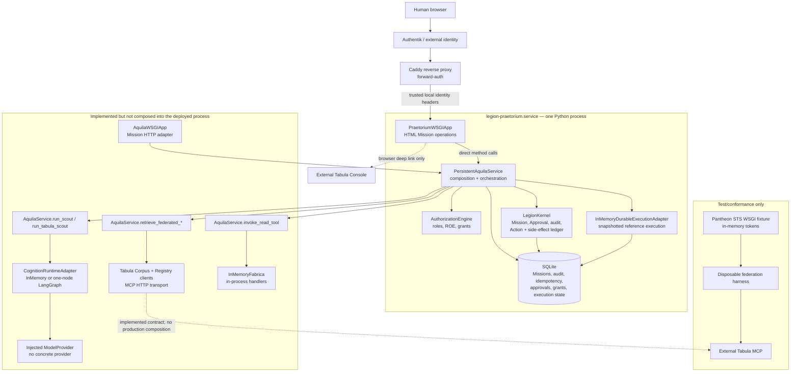
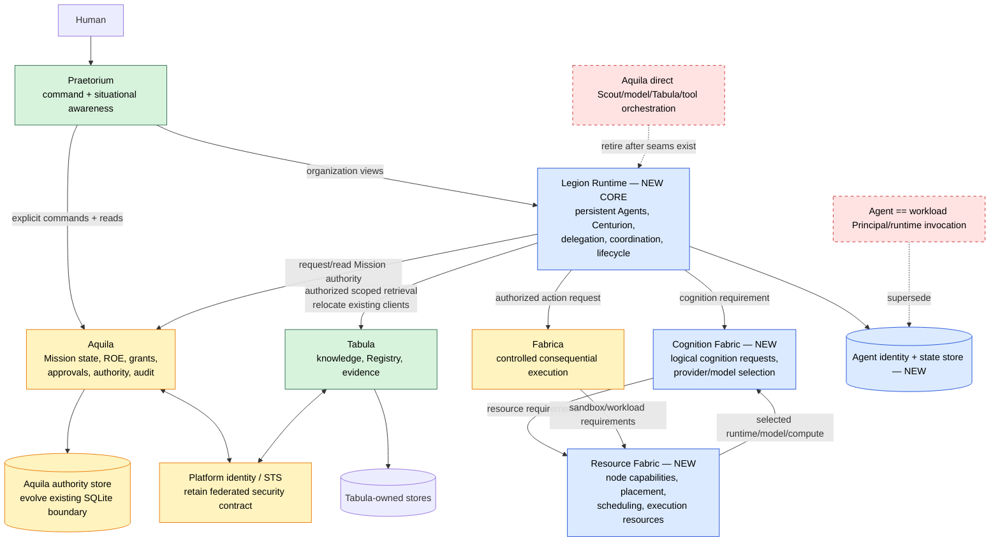

# Phase 0 — Architecture Reconciliation

Status: accepted after independent Claude Code review

Repository baseline: `5d095e4` (`main` and `pr/71-ai-box-setup`), including the pre-existing uncommitted working-tree checkpoint described in `docs/handoff.md`

Analysis date: 2026-09-17

## 1. Delivery intent

Phase 0 will establish an evidence-based map from the system implemented in this repository to the current Pantheon Legion product thesis and seven target domains: Praetorium, Aquila, Legion Runtime, Tabula, Fabrica, Cognition Fabric, and Resource Fabric.

The deliverable must make it possible to answer what has actually been built, which assets should be preserved, where implemented responsibility conflicts with the target boundaries, which target capabilities are merely absent, and what smallest subsequent change can prove persistent organizational identity. This advances the North Star by preventing the existing Mission-control substrate from being mistaken for the organization itself and by preserving useful authority, persistence, knowledge, and execution work while establishing a responsible entry point for the first persistent Centurion.

### Success criteria

1. The current architecture is derived from code, tests, contracts, and deployment composition, not component names alone.
2. Every material implemented component receives a target-domain mapping and a `KEEP`, `EXTEND`, `REFACTOR`, `RELOCATE`, `REPLACE`, `RETIRE`, or `INVESTIGATE` disposition supported by repository evidence.
3. Drift findings distinguish an active contradiction from a missing future capability.
4. Boundary findings distinguish `ACTIVE VIOLATION`, `TEMPORARY SUBSTRATE`, and `MISSING BOUNDARY`.
5. Existing assets and target capability gaps are explicit enough to prevent accidental rebuilding.
6. Major dependencies and their architectural implications are classified without removing or replacing them.
7. The Phase 1 recommendation proves persistent Agent identity with the smallest safe scope and does not begin implementation.
8. An independent Claude Code reviewer receives enough context to conduct an adversarial review, and all blocking or major findings are resolved or explicitly escalated.

### Constraints and non-goals

- No production code, schema, configuration, dependency, deployment, or runtime behavior will be modified.
- Phase 0 will not implement the target architecture, begin Phase 1, rename components, or create speculative contracts.
- Existing uncommitted work belongs to the user and will not be altered.
- Missing target capability will not by itself be labeled architectural drift.
- Working software will not be recommended for replacement merely because a cleaner design is imaginable.
- The external Tabula repository and live deployment are outside the local evidence boundary; claims about them will be limited to accepted contracts, repository fixtures, and explicitly identified prior documentation.

## 2. Analysis plan

### Initial methodology

1. Establish the source-of-truth order from current human direction, root instructions, accepted ADRs, current architecture/requirements, implementation, tests, and historical handoff material.
2. Record the exact Git baseline and separate committed behavior from the pre-existing dirty checkpoint.
3. Inventory deployables, packages, contracts, schemas, persistence, dependencies, tests, and deployment assets.
4. Trace six representative paths through actual code:
   - authenticated human Mission creation and command submission;
   - approval and consequential-action execution;
   - persistence, restart, recovery, and duplicate suppression;
   - Scout cognition and model invocation;
   - in-memory and federated Tabula retrieval;
   - declared Fabrica tool invocation.
5. Derive the current implemented architecture and communication paths from those traces.
6. Map each significant component or responsibility to one of the seven target domains and assign a disposition.
7. Test the requested drift hypotheses, recording positive, negative, and insufficient evidence.
8. Inventory reusable assets and capability gaps independently so absence is not conflated with incorrect placement.
9. Classify dependencies by current value, future value, coupling risk, and removal candidacy.
10. Recommend the smallest Phase 1 slice and define acceptance criteria without designing later phases.
11. Run the existing automated and acceptance suites as corroborating evidence, then self-evaluate the document against the Phase 0 success criteria.
12. Prepare and submit a bounded review package to independent Claude Code; remediate accepted findings and re-review material changes.

### Evidence rules

- Prefer paths and symbols over broad package labels.
- Treat documentation as target intent and code/runtime configuration as current-state evidence.
- Treat tests as evidence of exercised behavior, not automatic proof of intended architecture.
- Mark external or runtime claims `INVESTIGATE` when this repository cannot prove them.
- Use `ACTIVE VIOLATION` only for behavior that presently contradicts a target boundary; use `TEMPORARY SUBSTRATE` for a maturity-appropriate reference implementation behind a useful seam; use `MISSING BOUNDARY` where target separation has not yet been implemented.

## 3. Plan self-critique

### Findings against the initial plan

1. **Authority recency was underspecified.** The older M0/M1 glossary and roadmap describe an Agent primarily as a workload, while the newer root instructions require a persistent organizational identity independent of model, runtime, process, and machine. Reading all documents as equally current would produce a false reconciliation.
2. **Package-level classification was too coarse.** `AquilaService`, `LegionKernel`, and `PersistentAquilaService` each contain both correctly placed authority behavior and coordination/execution behavior that belongs elsewhere. One disposition per package would either discard valuable substrate or hide boundary crossings.
3. **The working tree is not a clean release baseline.** The current branch contains pre-existing uncommitted Praetorium deployment work. Ignoring it would omit the architecture actually being exercised; treating it as merged truth would overstate the accepted baseline.
4. **The planned behavior traces omitted the STS security fixture and browser deployment composition.** Both materially affect the implemented trust and service topology even though neither is a production target service.
5. **A test pass alone could overstate durability.** SQLite snapshots and a serialized in-process adapter prove restart behavior for a single composition, not multi-process reconciliation or a production durable executor.
6. **The target diagram could accidentally imply implementation.** New domains must be visually distinct from retained current assets and proposed seams.
7. **Phase 1 could become a broad orchestration refactor.** Proving a Centurion must first prove stable organizational identity and resumable assignment, not dynamic delegation, model routing, Resource Fabric, or a generalized agent topology.

### Revised plan

- Apply source precedence explicitly and list documentation conflicts as findings rather than silently harmonizing them.
- Classify separable responsibilities at path/symbol level when a package straddles domains.
- Show committed `HEAD` and the dirty deployment checkpoint separately in the evidence ledger.
- Add explicit traces for STS/federated authorization and the deployed Praetorium/Caddy composition.
- State the operational envelope of each durability claim (single-process, local SQLite, fixture, or external contract).
- Use separate current and target diagrams; style retained, relocated, new, and obsolete concepts distinctly in the target view.
- Constrain Phase 1 to persistent Centurion identity, Mission assignment, and restart continuity, reusing current Mission authority without adding multi-agent coordination or provider infrastructure.

Plan review outcome: **PROCEED**.

## 4. Source-of-truth reconciliation

The current human direction and root `AGENTS.md` are newer and higher precedence than the M0/M1 documents. Accepted ADRs remain authoritative where they do not conflict with that direction.

| Source | Status in this analysis | Reconciliation consequence |
|---|---|---|
| Root `AGENTS.md` | Current product thesis and target domain model | Controls the meaning of Agent, the North Star, and the seven-domain target. |
| `docs/adr/ADR-001-mission-root-object.md` | Accepted and compatible in its core decision | Preserve Mission as the durable root of organized work, but supersede its incidental statement that an agent is merely a workload. A persistent Agent may participate in many runs without becoming the owner of Mission truth. |
| ADR-002 and ADR-003 | Accepted security/integration decisions | Preserve federated workload authorization, product-owned resource policy, separate corpus/Registry contracts, revocation, and correlated audit. Change of caller/orchestrator does not invalidate these decisions. |
| `docs/architecture/legion-tabula-platform-plan.md` | Most recent tracked target plan, but narrower than the current thesis | Preserve its Aquila/Tabula/Portal ownership rules. Its model-fabric concept must be reconciled into Cognition Fabric plus Resource Fabric, and its roadmap no longer covers the first persistent Centurion. |
| `docs/architecture/legion-context.md` | Older M0 context, explicitly subordinate to the platform plan | Useful for authority and execution invariants; incomplete for persistent organizational identity and the current seven-domain architecture. |
| `docs/domain-glossary.md` | Canonical for the M0/M1 control-plane contracts, not fully current product vocabulary | Mission, Approval, ROE, workload identity, and audit terms remain useful. `Agent`, `SupervisorAgent`, `AgentInstance`, and related definitions require reconciliation because they bind identity to workload/package execution. |
| `docs/handoff.md` | Operational history and current dirty-checkpoint evidence | Useful for what was deployed and tested, but not authority to preserve historical product emphasis. |
| `Codex_Delivery_Instructions.md` | Sole matching delivery document in the working tree | Used for this lifecycle. The requested root name `CODEX_DELIVERY_INSTRUCTIONS.md` is absent; the existing file differs by case and word capitalization and is currently untracked. |

This reconciliation does **not** reject Mission as the durable unit of work. It rejects the implicit equation of the Mission control plane with the whole Legion product.

### Evidence ledger: committed baseline and working-tree checkpoint

The current-state view intentionally describes the repository **as inspected**, including the user's pre-existing uncommitted AI-box checkpoint. This ledger prevents that view from being mistaken for committed `HEAD` alone.

| Path | Initial state before Phase 0 output | Evidence role |
|---|---|---|
| `deploy/caddy/legion.caddyfile` | Modified checkpoint file | Existing Caddy/Authentik topology is in `HEAD`; the checkpoint changes the reverse-proxy port to `8106`. |
| `deploy/praetorium.env.example` | Modified checkpoint file | Adds temporary server-side Organization/Workspace defaults used by the inspected deployment. |
| `deploy/systemd/legion-praetorium.service` | Modified checkpoint file | Existing single-process systemd composition is in `HEAD`; the checkpoint selects the project virtualenv and port `8106`. |
| `docs/architecture/legion-tabula-platform-plan.md` | Modified checkpoint file | Updates roadmap status for the initial Praetorium slice; treated as current target-plan evidence, not implementation proof. |
| `docs/handoff.md` | Modified checkpoint file | Records the AI-box operational checkpoint and 138-test working-tree baseline; treated as historical/status evidence. |
| `praetorium/deployment.py` | Modified checkpoint file | Existing deployment composition is in `HEAD`; the checkpoint adds pipe-delimited Authentik groups, port `8106`, and validated server-side tenant scope. |
| `praetorium/wsgi.py` | Modified checkpoint file | Existing Mission UI is in `HEAD`; the checkpoint adds root redirect and server-supplied Organization/Workspace scope. |
| `tests/test_praetorium_user_acceptance.py` | Modified checkpoint file | Adds regression evidence for deployment-supplied tenant scope. |
| `tests/test_praetorium_wsgi.py` | Modified checkpoint file | Adds regression evidence for the root redirect and updated UI constructor/scope. |
| `deploy/README.md` | Untracked checkpoint file | Deployment procedure evidence; not an accepted architecture source. |
| `deploy/setup-ai-box.sh` | Untracked checkpoint file | Current setup automation evidence; deployment-specific, not an architectural contract. |
| `tests/test_praetorium_deployment.py` | Untracked checkpoint file | Regression evidence for Authentik header parsing and deployment configuration. |
| `AGENTS.md` | Untracked governance input supplied before Phase 0 writing | Highest-precedence local product/architecture instructions for this analysis. |
| `Codex_Delivery_Instructions.md` | Untracked governance input supplied before Phase 0 writing | Required delivery-assurance process used for this analysis. |
| `docs/architecture/phase-0-architecture-reconciliation.md` | New Phase 0 artifact | This analysis; no production behavior. |
| `docs/architecture/phase-0-claude-review-package.md` | New Phase 0 artifact | Independent review context and durable review/remediation record; no production behavior. |

All other implementation paths cited below were read from committed `HEAD` unless the text explicitly says otherwise. The **CURRENT IMPLEMENTED ARCHITECTURE** diagram represents the inspected working tree. Its checkpoint-only deltas are the operational port/interpreter selection, Authentik group delimiter correction, root redirect, and server-supplied tenant scope; the central topology—Praetorium and `PersistentAquilaService` composed in one Python process over SQLite—already exists at `HEAD`.

## 5. Current-state architecture

### CURRENT IMPLEMENTED ARCHITECTURE

The only repository-composed deployable application is one local WSGI process started by `deploy/systemd/legion-praetorium.service`. That process embeds Praetorium and `PersistentAquilaService`; it is not a distributed Praetorium-to-Aquila deployment. The remaining major capabilities are library adapters, reference implementations, or conformance fixtures.

Dashed paths are implemented seams or navigation links, not evidence of a production-composed runtime path.

### Implemented behavior traces

1. **Human command path.** Caddy supplies Authentik headers to `CaddyForwardAuthAuthenticator`; `AuthentikPrincipalMapper` maps configured groups to roles; `PraetoriumWSGIApp` calls `AquilaService` methods directly; `AuthorizationEngine` and `LegionKernel.submit_command` decide and mutate; `PersistentAquilaService` writes the snapshot, audit facts, idempotency result, and execution snapshot in a SQLite transaction.
2. **Approval/action path.** `REQUEST_ACTION` creates an `Action` and possibly an `Approval` inside `LegionKernel`. `AquilaService.execute_action` rechecks the workload's `DelegationGrant`, ROE, capability, and Approval, starts the in-memory durable adapter, then calls `LegionKernel.execute_action`. The only "side effect" is an internal counter; no external mutating tool crosses Fabrica.
3. **Recovery path.** `PersistentAquilaService` reconstructs Missions, audit, Approvals, delegation grants, side-effect counters, and the serialized in-memory execution adapter from one SQLite database. Tests recreate the service and verify command replay, grant revocation, execution state, and duplicate suppression. There is no background reconciler, lease, queue, outbox, or production workflow provider.
4. **Scout/model path.** `AquilaService.run_scout` authorizes `READ_MISSION`, constructs a minimal `MissionContext`, and directly invokes a caller-supplied cognition runtime. `ScoutRequest.scout` is a `Principal`, not a persistent Agent record. The optional LangGraph adapter is a one-node graph; `ModelProviderScoutResponder` directly invokes an injected provider and returns digest-only provenance.
5. **Tabula path.** The local `InMemoryTabula` is a test double. The separate corpus and Registry clients validate binding references, correlation, retries, safe error envelopes, and response provenance over MCP HTTP. `AquilaService.retrieve_federated_*` both authorizes and performs the call. Token acquisition is an injected callable; the STS fixture is not wired into production composition.
6. **Fabrica path.** `AquilaService.invoke_read_tool` resolves an in-memory tool, obtains a fresh decision, applies ROE capability filters, and calls its in-process handler. Only read tools are admitted. Filesystem, network, and credential fields are metadata, not enforced isolation.

### Current responsibility map

| Implemented area | What it actually owns today |
|---|---|
| Praetorium | Server-rendered Mission list/create/detail; raw command type + JSON payload entry; Approval buttons; timeline list; Tabula deep link. |
| Aquila/kernel | Mission aggregate, ROE, Approval, role policy, grants, authoritative audit, persistence composition **and** direct coordination of executions, Scouts, models, Tabula reads, and read tools. |
| `legion_runtime` | A provider-neutral execution-record state machine only. It has no Agent identity, coordination, delegation, or Agent lifecycle. |
| `legion_cognition` | Stateless Scout request/result types, conformance tests, a one-node LangGraph adapter, and direct provider invocation policy. |
| `legion_tabula` | One in-memory knowledge fake plus two real, validated read clients and MCP transport. It does not own Tabula data. |
| `legion_fabrica` | In-process declared-tool registry and handler dispatch; no sandbox, credential delivery, or external execution service. |
| `pantheon_sts` | Deterministic security fixture, not a production identity/token service. |
| Resource Fabric | No implementation. |

### Persistence and operational envelope

- `SQLiteMissionStore` persists JSON Mission snapshots, sequenced audit events, and command idempotency records.
- `PersistentAquilaService` creates auxiliary JSON tables for Approvals, grants, side-effect counters, and one global serialized execution snapshot.
- `BEGIN IMMEDIATE` and compare-and-swap version writes provide a useful single-database serialization boundary; the concurrent-writer test proves losing writes leave no partial authority record.
- Durability is local and process-restart oriented. It does not prove node loss, multi-node scheduling, external action reconciliation, or non-transactional delivery. The accepted platform plan already requires an outbox before such delivery.
- No artifact store, Agent store, Task/assignment store, node registry, capability inventory, telemetry backend, or model/resource catalog exists.

### APIs and deployables

- `api/openapi.yaml` and `AquilaWSGIApp` expose Mission CRUD-like operations, commands, approvals, timeline, and cancellation. They do not expose Agents, tasks, coordination, cognition, Tabula retrieval, Fabrica, grants, or execution operations.
- `PraetoriumWSGIApp` bypasses the HTTP adapter and calls the in-process service. That is a valid local composition but not evidence of a stable service boundary.
- The deployed systemd unit runs only Praetorium/Aquila/SQLite on loopback. Caddy and Authentik are external deployment dependencies. The external Tabula Console is only linked.
- `pantheon_sts.wsgi.STSWSGIApp` and federation servers are test fixtures with explicit warnings against production use.

## 6. Target architecture mapping

### TARGET LEGION ARCHITECTURE

The target introduces contracts, not a requirement to split every domain into a separate process immediately. A local-first single-process deployment may compose these domains in-process while preserving ownership and interfaces.

### Mapping principles

- Keep Mission state, authority, grant, Approval, and authoritative Mission audit in Aquila.
- Place persistent Agent identity, Centurion/Scout roles, assignment, planning, delegation of work, and dynamic coordination in Legion Runtime.
- Let Legion Runtime request authority from Aquila; do not let Aquila decide what work should happen or invoke cognition as part of its authority role.
- Retain Tabula as an external bounded knowledge authority. Move call orchestration to Legion Runtime while retaining Aquila authorization and ADR-002/003 security.
- Keep consequence behind Fabrica. A durable executor or Resource Fabric may run the workload, but cannot become the authorization source.
- Move model/provider selection and invocation policy behind Cognition Fabric. Agent identity and Legion Runtime must request capabilities, not named models.
- Treat resource discovery, placement, and execution capacity as Resource Fabric. Do not relabel the current in-memory execution record adapter as a scheduler.

## 7. Reconciliation matrix

| Current component / symbol | Current responsibility | Target domain | Disposition | Evidence | Required change | Roadmap phase |
|---|---|---|---|---|---|---|
| `legion_kernel.Mission`, lifecycle, version, constraints, participants | Authoritative Mission aggregate | Aquila | KEEP | `legion_kernel/kernel.py`; ADR-001; M1 acceptance | Preserve command-only mutation and optimistic versioning; extend references to persistent Agents/tasks without embedding their state. | Phase 1 interface use; later extension |
| `LegionKernel.submit_command` | Validates and applies Mission commands; emits events | Aquila | KEEP | Command protocol and kernel tests | Preserve serialized acceptance. Gradually align domain event names/identity fields; do not route Agent planning into commands unless Mission truth changes. | Ongoing Aquila |
| `LegionKernel` Action/Approval logic | Action proposals, freshness, consumption | Aquila | EXTEND | Approval tests; `validate_action_execution` | Keep authority/freshness decisions; external execution receipt and reconciliation need explicit Fabrica contracts before real mutation. | Before mutating execution |
| `LegionKernel.execute_action` and `side_effects` | Simulates side effects and duplicate suppression inside the authority kernel | Fabrica + Aquila receipt | RELOCATE | `kernel.py:execute_action`; M1-005 | Retain as a test fake. Real effects must cross Fabrica; Aquila should record authorization/result and idempotency facts, not execute the effect. | Before mutating execution |
| `AuthorizationEngine`, `AuthorizationRequest/Decision` | Deterministic role, ROE, grant, capability policy | Aquila | EXTEND | Authorization contract/tests | Preserve fail-closed decision seam; add policy inputs only as needed for Agent/task/workload distinctions and tenant scope. | Phase 1 minimal mapping; later policy |
| `DelegationGrant` + issue/revoke/persistence | Bounded, expiring, revocable workload authorization | Aquila | KEEP | ADR-002; delegation restart tests | Preserve opaque grant IDs and audit. Explicitly distinguish authorization delegation from Centurion-to-Scout work delegation. | Phase 1 terminology/interface |
| `Approval` + approval audit | Bounded human authorization | Aquila | KEEP | Approval semantics; tests | Preserve. Improve Praetorium decision context and identity-chain output; avoid making approvals routine workflow steps. | Praetorium/Aquila evolution |
| `AuditEvent` + SQLite ledger | Mission-authoritative ordered facts | Aquila | EXTEND | `audit_events`; reconstruction tests | Add consistent `actor_id`, `task_id`, `execution_id`, `grant_id`, and cross-domain references; populate the existing `causation_id` consistently. Store large/raw outputs as artifacts or references. | Phase 1 identifiers; later observability |
| `SQLiteMissionStore` Mission/audit/idempotency | Local atomic authority persistence | Aquila | KEEP | transaction/CAS tests | Keep as local/reference implementation. Preserve repository contract when adding a shared store; do not put Agent state in Aquila tables. | Keep through Phase 1 |
| `PersistentAquilaService` authority persistence | Composes Mission, grant, approval, audit transactions | Aquila | REFACTOR | restart and rollback tests | Preserve atomic authority writes; separate execution/cognition/Tabula/tool composition and their state into owning domains. | Incremental after Phase 1 seam |
| `PersistentAquilaService` execution snapshot and side-effect tables | Stores runtime/execution state in Aquila's DB | Legion Runtime / Resource Fabric / Fabrica | RELOCATE | `persistent_execution_state`, `persistent_side_effects` | Leave for M1 compatibility until replacement contract exists; new Agent state must not be added here. | Phase 1 Agent store; later migration |
| `AquilaService.run_scout`, `run_tabula_scout` | Chooses and runs cognition, sequences retrieval | Legion Runtime | RELOCATE | Direct calls in `service.py` | New coordination belongs in Legion Runtime. Aquila should provide Mission read/authority decisions and receive material audit facts. | After Phase 1 identity proof |
| `AquilaService.retrieve_federated_*` | Authorizes and performs Tabula calls | Legion Runtime + Aquila authorization | RELOCATE | `service.py`; ADR-003 | Preserve decision/audit behavior and clients; move call sequencing out of Aquila behind an authority port. | After Phase 1 identity proof |
| `TabulaCorpusClient`, `TabulaRegistryClient`, `McpHttpTransport` | Validated, separate, correlated read integrations | Tabula integration used by Legion Runtime | KEEP | client and conformance tests | Preserve contract separation and validation. Add production token/STS composition and remaining live failure cases. | Integration hardening |
| `InMemoryTabula` | Scoped deterministic knowledge fake | Tabula test adapter | KEEP | Tabula unit tests | Keep explicitly as a fake; never treat as Tabula's system of record. | Ongoing tests |
| `CognitionRuntimeAdapter`, `MissionContext`, Scout validation | Bounded stateless cognition invocation | Cognition Fabric adapter + Legion Runtime role input | REFACTOR | conformance matrix | Preserve minimal context and no-mutation constraints. Replace `Principal` as Scout identity with a persistent Agent reference plus separate workload execution identity. | After Phase 1 identity model |
| `LangGraphScoutRuntime` | One-node recommendation graph | Cognition Fabric implementation | INVESTIGATE | One node; no tools; dependency required at package import | Keep isolated pending evidence that it adds value over direct invocation. It must not define Agent identity or organizational workflow. | Cognition Fabric phase |
| `ModelProviderScoutResponder`, redaction, provenance | Direct provider invocation, retry, digests | Cognition Fabric | RELOCATE | platform plan already notes incomplete model-fabric boundary | Preserve redaction, bounded retry, and provenance concepts; wrap them in capability-based cognition requests and provider/resource selection. | Cognition Fabric phase |
| `DurableExecutionAdapter` + in-memory implementation | Execution attempt lifecycle and recovery fake | INVESTIGATE: Legion Runtime durability vs Resource Fabric execution | REFACTOR | provider-neutral state machine and restart tests | Preserve semantics; decide ownership before a production provider. Do not expose provider IDs as Agent identity or equate this with Resource Fabric. | Architecture decision before provider adoption |
| `ToolExecutionAdapter`, `ToolDefinition`, `ToolInvocation` | Declared tool boundary and authorization reference | Fabrica | EXTEND | Fabrica tests | Preserve contract shape; add enforced isolation, workload identity, credential delivery, idempotency, artifacts, and mutating Action binding. | Fabrica phase; before mutation |
| `InMemoryFabrica` | Direct in-process handler registry | Fabrica test adapter | KEEP | read-tool tests | Keep as a test fake. Do not deploy it as the consequential boundary. | Ongoing tests |
| `AquilaService.invoke_read_tool` | Orchestrates authorized read tool call and stores output | Legion Runtime calling Fabrica; Aquila decision/audit | RELOCATE | direct call and audit output in `service.py` | Move sequencing to Runtime; keep fresh Aquila decision. Replace raw output in Mission audit with safe result/artifact reference. | After Phase 1; before broader tools |
| `Principal` / `PrincipalType.WORKLOAD` | Authentication/authorization subject with roles | Aquila identity input and workload identity reference | KEEP | OIDC and grant tests | Preserve as a principal concept; explicitly state it is **not** Agent identity. Add mapping from Agent to current workload execution separately. | Phase 1 prerequisite |
| Mission `Participant` | Durable role/scope projection, not authority | Aquila Mission state | KEEP | participant restart tests; handoff invariant | Preserve as coordination context. Reference persistent Agent IDs when available without making participation self-authorizing. | Phase 1 extension only if needed |
| `pantheon_sts` | Signed-assertion, opaque-token conformance fixture | Platform security supporting Aquila/Tabula/Fabrica | KEEP | ADR-002 and STS tests | Keep fixture clearly non-production. Production issuer, keys, mTLS, persistence, and operations remain unimplemented. | Security/platform integration |
| `PraetoriumWSGIApp` | Human Mission operations UI | Praetorium | EXTEND | user-acceptance tests | Preserve thin-client behavior and no authoritative state. Replace raw command/JSON UX with intentful views; add organizational/Agent awareness and decision context. | Phase 1 read view, later UX |
| Direct Praetorium → `AquilaService` in-process call | Local composition | Praetorium/Aquila seam | INVESTIGATE | deployed `praetorium.deployment` | Acceptable local-first composition if the interface remains explicit; decide whether an HTTP/process boundary is needed from operational evidence, not architectural aesthetics. | Deployment evolution |
| Caddy/AuthentiK forward-auth adapter | Human authentication boundary for current deployment | Praetorium edge / platform identity | EXTEND | loopback peer check, group mapping | Keep deployment-specific. Replace static tenant defaults with verified tenant scope before multi-tenant use; retain separate app audiences. | Identity hardening |
| OpenAPI, JSON schemas, normative Mission docs | Public control-plane contracts | Aquila contracts | KEEP | schema tests and WSGI tests | Preserve versioning. Add Agent/Runtime contracts separately rather than expanding Mission schemas to own Agent state. | Phase 1 new contract, no rewrite |
| M1 acceptance harness | Mission authority behavioral gate | Cross-cutting quality | KEEP | seven passing scenarios | Keep unchanged as regression evidence; add separate persistent-Agent acceptance rather than redefining M1. | Phase 1 new acceptance suite |
| Domain glossary Agent/Centurion/Scout definitions | Treat Agent as capability-bearing workload/package instance | Documentation spanning Runtime/Cognition/Resource | REPLACE | conflicts with current root invariant | Reconcile vocabulary through a focused documentation decision before Phase 1 code: Agent identity, Agent role, workload identity, runtime instance, model, and package must be separate. | Phase 1 prerequisite |
| Resource/node scheduling | No component | Resource Fabric | INVESTIGATE | no `agent_id`, `node_id`, node registry, or scheduler symbols | Do not build in Phase 1. Later define the smallest capability/constraint contract from real local resources. | Post-Centurion |

No current production component is marked `RETIRE` outright. Obsolete *responsibilities* should be retired only after replacement seams prove equivalent behavior; useful reference fakes should remain in tests.

## 8. Architecture boundary violations

| Type | Current behavior and code | Target boundary | Why it matters | Likely remediation | Urgency |
|---|---|---|---|---|---|
| **ACTIVE VIOLATION** | `AquilaService.run_scout` and `run_tabula_scout` decide sequencing and invoke cognition. | Aquila answers “may”; Legion Runtime decides “what/who/next.” | This makes the authority plane the nascent agent orchestrator and leaves no home for persistent organizational state. | Introduce Legion Runtime identity/coordination first, then move orchestration behind Aquila authority/read interfaces. | High after Phase 1 identity proof |
| **ACTIVE VIOLATION** | `AquilaService.retrieve_federated_corpus/registry` and `invoke_read_tool` both authorize and perform resource/tool calls. | Runtime coordinates; Tabula knows; Fabrica executes; Aquila authorizes/audits. | Direct calls concentrate cognition, knowledge, and execution flow in Aquila and make later dynamic coordination harder to place. | Preserve clients and decision recording, relocate sequencing incrementally; do not rewrite protocols. | High before autonomous coordination |
| **ACTIVE VIOLATION** | `record_tool_result` stores the complete `ToolResult.output` in authoritative Mission audit. | Aquila audit should retain safe facts/references; Fabrica/artifact storage owns potentially large or sensitive output. | Tool output can be unbounded or secret-bearing and conflicts with the existing “store raw output by reference” rule. | Define safe result summary/artifact references before expanding tool use. | High before non-fixture tools |
| **TEMPORARY SUBSTRATE** | `LegionKernel.execute_action` increments an internal side-effect counter; `PersistentAquilaService` persists it. | Consequential execution crosses Fabrica; runtime/resource layers handle attempts. | It is safe as failure-injection evidence because no world mutation occurs, but it must not become the real execution path. | Retain test fake; require Fabrica-bound Action execution and idempotency receipt before external mutation. | Blocker for real mutation, not for Phase 1 |
| **TEMPORARY SUBSTRATE** | Praetorium embeds Aquila and uses static deployment Organization/Workspace UUIDs. | Praetorium is a client; identity and tenant scope must be verified. | In-process composition is locally useful, while static scope is not a multi-tenant authority model. | Preserve local composition; harden scope derivation before shared tenants. | Medium |
| **TEMPORARY SUBSTRATE** | `InMemoryDurableExecutionAdapter` snapshot is stored in Aquila's SQLite database. | Runtime intent and execution/resource state need explicit owners. | The fake proves semantics, not a production durable scheduler. Premature replacement would discard useful tests. | Keep until an ownership ADR and real failure requirements justify a provider. | Low for Phase 1; high before external work |
| **TEMPORARY SUBSTRATE** | `InMemoryFabrica` directly calls Python handlers; policy fields are descriptive. | Fabrica must enforce sandbox, network, filesystem, credentials, and workload identity. | Metadata without enforcement is not a security boundary. | Keep as test adapter only; adopt/adapt isolation infrastructure later. | High before real tools |
| **MISSING BOUNDARY** | `ScoutRequest.scout` is a workload `Principal`; there is no Agent record/state. | Persistent Agent identity is Legion Runtime state; workload identity is an execution resource. | Restarts or model/runtime changes cannot preserve an organizational actor because none exists. | Phase 1 persistent Centurion identity plus explicit Agent↔workload mapping. | Immediate Phase 1 |
| **MISSING BOUNDARY** | `ModelProviderScoutResponder` directly receives a provider; no cognition capability request/router exists. | Cognition Fabric selects model/runtime/resource from requirements. | Provider neutrality at a Python protocol is useful but does not provide capability scheduling, health, privacy, or locality policy. | Retain provider protocol behind a later Cognition Fabric contract. | Post-identity |
| **MISSING BOUNDARY** | No node registry, capability advertisement, placement, or scheduler. | Resource Fabric owns resource discovery and placement. | There is no way to use heterogeneous local resources without hard-wiring composition. | Wait for actual resource use cases; then introduce the smallest capability registry/scheduler seam. | Post-identity |
| **MISSING BOUNDARY** | No durable assignment/task/plan state or coordinator reconciliation loop. | Legion Runtime owns dynamic coordination and Agent lifecycle. | A Centurion cannot resume intent, delegate, or adapt after process loss. | First persist identity/assignment/checkpoint; add dynamic coordination only after that proof. | Immediate then incremental |

## 9. Architectural drift findings

### D1 — Aquila has become the de facto orchestration composition root

**Finding:** confirmed active drift. `AquilaService` imports cognition, Tabula, Fabrica, and durable execution contracts and owns methods that sequence all four. `PersistentAquilaService` persists their audit and execution state. This was reasonable for proving M1 safety, but conflicts with the current separation between Aquila authority and Legion Runtime coordination.

**Not drift:** Aquila deciding Mission authorization, grant validity, ROE, Approval freshness, and recording authoritative Mission-relevant facts remains correct.

### D2 — Agent is represented as a workload invocation, not a persistent identity

**Finding:** confirmed conceptual/implementation drift. The only Scout identity is `ScoutRequest.scout: Principal`; tests construct it ad hoc as `PrincipalType.WORKLOAD`. There is no `agent_id`, Agent repository, Agent lifecycle, assignment, or state. The glossary reinforces the older model by defining Agent as a capability-bearing workload and AgentInstance as a runtime execution.

**Missing capability distinction:** the absence of Centurions, Cohorts, and Agent persistence is not itself misconduct by the earlier M1 substrate. The drift is the vocabulary and API shape that currently equate the role with a workload principal.

### D3 — The deployed product surface is Mission administration, not yet an AI organization

**Finding:** product-center-of-gravity risk, not a present boundary violation. Praetorium exposes Mission creation/list/detail, a raw `command_type` plus `payload_json` form, Approval decisions, and event names. There is no Centurion, Agent status, work delegation, evidence synthesis, or outcome report. The codebase is correspondingly dominated by control-plane governance.

The documentation explicitly called M1 a substrate, so missing organizational capability should not be relabeled as failed architecture. It becomes drift only if future work keeps extending Mission administration instead of adding Legion Runtime.

### D4 — Praetorium is a thin administrative console rather than a command surface

**Finding:** confirmed UX drift risk. The UI delegates correctly to Aquila and owns no state, which should be preserved. However, asking humans to enter protocol command names, idempotency keys, and JSON payloads is an API console, not meaningful high-level command. The Approval view shows capability/status but not the full evidence, uncertainty, risk, contrary evidence, authority, and consequences expected by the current product thesis.

An incidental current defect also illustrates immaturity: the form submits `REJECT`, while `LegionKernel.decide_approval` accepts `DENY`; the existing user acceptance test exercises only approval. This is recorded, not fixed in Phase 0.

### D5 — Cognition is directly provider-injected but not vendor/hardware hard-coded

**Finding:** missing Cognition Fabric, with localized coupling. `ModelProviderScoutResponder` takes an injected `ModelProvider`; response provenance names provider/model. No concrete endpoint, credential lookup, vendor SDK, named model, GPU, NPU, CUDA, or host placement is present. Thus the repository has **not** drifted into a vendor-specific cognition architecture, but it also lacks capability requests, routing, health, privacy/locality constraints, and resource selection.

### D6 — Consequential execution does not yet have an enforced Fabrica boundary

**Finding:** boundary missing for real mutation, not an observed production bypass. Read tools pass through the `ToolExecutionAdapter`, but external Action execution is simulated inside `LegionKernel`; Fabrica itself directly calls Python handlers and does not enforce its policy metadata. No production mutation adapter exists. This must be resolved before adding one.

### D7 — Tabula knowledge is kept distinct from authority

**Finding:** no drift found in the implemented contracts. Separate corpus and Registry clients, Tabula-owned scope bindings, fresh Aquila authorization, delegated tokens, response validation, provenance, and the explicit rule that Registry discovery is not execution authority all preserve the boundary. The remaining issue is that Aquila performs the call instead of Legion Runtime.

### D8 — No predetermined multi-agent workflow has displaced dynamic coordination

**Finding:** no active drift; dynamic coordination is absent. The Mission lifecycle is a deterministic authority state machine, which is appropriate. The LangGraph implementation has one recommendation node and no tools. There is no static multi-agent DAG pretending to be Legion. LangGraph's future value remains `INVESTIGATE` because a one-node graph currently adds import/dependency cost without demonstrating adaptive coordination.

### D9 — Deployment assumptions remain mostly deployment-local

**Finding:** no architecture-level hardware drift. The AI-box artifacts hard-code a local user, repository path, domain, port, and systemd layout, but those values are confined to deployment files. There are no DGX/Olares/CUDA/OpenVINO/NVIDIA/Intel dependencies in domain contracts. Portability of the current deployment is limited, but deployment specificity has not leaked into Mission, cognition, or execution abstractions.

## 10. Existing assets to exploit

| Asset | Already provides | Target home | Preserve unchanged | Must evolve |
|---|---|---|---|---|
| Mission aggregate and command protocol | Stable ID/version, lifecycle, constraints, ROE, participant projection, idempotent commands | Aquila | Mission as root unit of work; command-only mutation; optimistic concurrency | Add references to Agent/task/evidence without owning their state. |
| SQLite authority persistence | Atomic local snapshots, audit sequence, idempotency, CAS, restart restoration | Aquila | Transaction boundary and behavioral tests | Shared deployment backend/outbox only when external delivery requires it. |
| OIDC/AuthentiK mapping | Issuer/audience/subject validation seam and explicit group-to-role mapping | Aquila/Praetorium edge | Authentication distinct from authorization; allowlisted role mapping | Concrete JWT verification in Aquila HTTP deployment; tenant scope; workload authentication. |
| Authorization engine | Deterministic, inspectable decisions with policy version and reason | Aquila | Fail closed; ROE ceiling; current-state re-evaluation | Agent/workload separation and richer resource context without embedding coordination policy. |
| Delegation grants | Opaque, bounded, expiring, revocable, persisted workload authority | Aquila | Issuer authority, attenuation, audit, restart behavior | Map grants to transient Agent workload executions; distinguish from work delegation. |
| Approval mechanism | Bound action hash/version/ROE, expiry, decision, consumption | Aquila | Freshness and execution-time validation | Better decision context/quorum/revocation as real actions require; preserve human meaning. |
| Authoritative audit | Ordered Mission facts and correlated decision/result events | Aquila | Append-only authority history and safe credential exclusion | Complete identity chain and cross-domain IDs; artifact references; retention policy. |
| Durable execution state machine | Provider-neutral states, idempotent start, signals, recovery snapshot | Runtime/Resource seam to be decided | Behavioral semantics and failure tests | Production durability, leases/reconciliation/outbox, correct domain ownership. |
| Scout context/conformance | Minimal Mission projection, read-only capabilities, adapter failure matrix | Legion Runtime + Cognition Fabric | Bounded context and mutation prohibition | Persistent Agent reference; task identity; capability-based cognition request. |
| Model invocation safety | Input redaction, bounded timeout retry, digest provenance, no credentials in contract | Cognition Fabric | Safety/provenance policies | Provider selection, logical capabilities, locality/privacy/cost constraints, resource scheduling. |
| Tabula clients | Separate corpus/Registry semantics, MCP transport, bounded retry, response validation, safe audit references | Tabula adapter used by Runtime | ADR-002/003 contracts and separation | Production STS/token composition, remaining live failure matrix, call orchestration relocation. |
| Fabrica contracts | Declared capabilities, side-effect class, authorization/correlation IDs, policy metadata | Fabrica | Contract-first capability vocabulary and fresh authorization | Enforced sandbox/network/filesystem/credentials, workload identity, artifact results, mutation path. |
| STS fixture and schemas | Signed assertion, opaque token, introspection/revocation behavior, cross-service vocabulary | Platform security | Deterministic adversarial conformance fixture | Production service is a separate adopt/build decision; fixture must remain clearly non-production. |
| Praetorium shell | Authenticated Mission journey with no authoritative UI state | Praetorium | Thin-client ownership and Tabula deep link | Human-centered commands, Centurion/Agent visibility, evidence/risk-rich approvals, outcome reporting. |
| Contract and acceptance assets | OpenAPI, JSON schemas, seven M1 scenarios, 138 focused unit tests | Cross-cutting | Existing gates as regression protection | Add separate organizational identity/recovery acceptance; do not mutate M1 goalposts. |

## 11. Capability gaps

| Target capability | Readiness | Existing foundation | Gap / required evidence later |
|---|---|---|---|
| Persistent Agent identity | Absent | Stable UUID patterns; SQLite repository patterns; Principal identity vocabulary | Durable Agent record independent of model/runtime/process/workload; restart identity test. |
| Agent state independent of runtime/model | Absent | Mission and execution snapshots show local persistence technique | Agent-owned state/checkpoint and explicit separation from invocation provenance. |
| Centurion | Absent | Mission read/command contracts; Scout seam | Persistent role/identity, Mission assignment, resumable coordination intent. |
| Scouts | Partial but stateless | Read-only Scout request/runtime/conformance | Persistent Scout identity/role, Centurion delegation, task/result lifecycle. |
| Cohorts / Centuries | Documentation only | Participant projection | No durable organizational definitions or policy. Not needed for first Centurion. |
| Task Forces | Documentation/ADR mention only | Mission participants | No Mission-scoped grouping or lifecycle. Defer until multiple Agents create real need. |
| Work delegation | Absent | Authorization `DelegationGrant` | Separate task/objective delegation model; do not overload authority grants. |
| Dynamic coordination | Absent | No static DAG to unwind; Mission commands can accept changing state | Durable plan/assignment/checkpoint, event-driven reconsideration, stop/redirect behavior. |
| Cognition Fabric | Absent | Provider protocol, redaction, provenance, runtime adapter | Logical capability request, selection/routing/health, policy constraints, Resource Fabric interface. |
| Resource Fabric | Absent | Durable execution record only | Node registration, resource/capability inventory, placement, scheduling, observed health. |
| Capability-based scheduling | Absent | String capability vocabulary in ROE/tools | Typed requirements/constraints and scheduler based on real resources. |
| Fabrica execution boundary | Partial reference | Tool contracts and authorization tests | Enforced isolation, bounded credential delivery, workload identity, mutation/idempotency/reconciliation. |
| Workload identity | Partial logical identity | `PrincipalType.WORKLOAD`, grants, STS fixture | Authentication/attestation of actual workload; lifecycle linkage to Agent execution; credential boundary. |
| Bounded credential delivery | Fixture only | STS opaque tokens; `credential_policy` metadata | Production broker/secret delivery, rotation, non-context exposure, target-specific credentials. |
| Mission-correlated evidence | Partial | Scout evidence objects; Tabula audit references; correlation IDs | Durable evidence/artifact record with Agent/task/execution provenance and controlled content retention. |
| Operational explainability | Moderate authority substrate | Ordered audit, policy IDs/reasons, model/tool/Tabula facts | Complete identity chain, task/execution IDs, actual resource/model choice, traces/metrics/artifacts, user-facing synthesis. |
| Durable recovery/reconciliation | Partial local proof | SQLite restore, execution snapshot, idempotency and restart tests | Agent intent recovery, pending assignment reconciliation, real external delivery/outbox, process/node loss behavior. |

## 12. Dependency assessment

| Dependency / infrastructure | Classification | Architectural implication | Recommendation |
|---|---|---|---|
| Python standard library dataclasses/WSGI/`urllib` | Actively useful | Keeps core and transports small and inspectable; WSGI server is development-grade | Keep current seams; choose production servers from operational need. |
| SQLite | Actively useful local/reference; potentially insufficient shared substrate | Strong local-first fit and atomic test boundary; single-node/process assumptions | Keep for Phase 1 identity proof. Do not prematurely replace; preserve a repository seam and outbox requirement for external delivery. |
| `langgraph>=1.2,<2` | Questionable current value; potentially useful | A one-node graph provides little demonstrated advantage and is imported eagerly through `legion_cognition.__init__`, causing all Aquila imports to fail when absent | Keep isolated pending real adaptive coordination evidence. Consider lazy/optional packaging later; do not let graph semantics define Agents or plans. |
| `cryptography>=41,<45` | Actively useful for conformance; potentially useful platform primitive | Provides real Ed25519 assertion verification while STS remains a fixture | Keep. Production key custody/rotation is not solved by the library. |
| MCP Streamable HTTP contract | Actively useful | Mature integration protocol for Tabula and a plausible Fabrica transport; protocol must not define domain authority | Keep behind Legion-owned clients/contracts. |
| Authentik | Actively useful deployment integration | External identity is optional deployment infrastructure, not product authority | Keep adapter-based and audience-specific; avoid coupling Agent identity to IdP sessions. |
| Caddy | Actively useful deployment infrastructure | Reverse proxy/forward-auth is deployment-specific | Keep outside domain model; current hard-coded host is not a minimum architecture. |
| systemd + setup script | Incidental but useful current deployment | Hard-coded user/path/port reduces portability but stays in deploy assets | Keep as one deployment profile; add alternatives only when needed. |
| Pantheon STS fixture | Actively useful test infrastructure; unsuitable production dependency | Proves security semantics but stores state in memory and uses static service headers | Keep fixture; investigate adopt/adapt/build for production security service separately. |
| No web framework / ORM / policy engine | Not a gap by itself | Avoids premature framework coupling; hand-written validation/persistence will become costly only with broader scope | Adopt mature infrastructure only when requirements justify it; keep Legion contracts stable. |

No dependency is currently a clear removal candidate. LangGraph is the primary **questionable** dependency because its eager import affects the entire Aquila package and the implemented graph has one node, but replacement/removal requires product evidence, not taste.

## 13. Architecture risks and open questions

### Risks

1. **Vocabulary risk:** coding Phase 1 before deciding `Agent identity != workload identity != runtime instance` would entrench the existing conflation.
2. **Aquila gravity:** every new integration added to `AquilaService` makes the later Legion Runtime extraction riskier and keeps governance at the product center.
3. **False durability confidence:** current restart tests are strong for a local SQLite composition but do not prove background reconciliation or external exactly-once effects.
4. **Audit data risk:** read-tool outputs are embedded; event identity fields are incomplete; schema-supported trace references are not populated.
5. **Interface ambiguity:** ownership of the durable execution adapter between Legion Runtime and Resource Fabric is unresolved.
6. **Identity/scope risk:** deployed human roles come from Authentik groups, but Organization/Workspace are static environment defaults. Workload principals are constructed by callers/tests rather than authenticated as processes.
7. **Security-platform gap:** production STS issuer, key distribution, service authentication, persistence, and operations are absent.
8. **UI/product risk:** continuing raw Mission protocol forms could optimize the API console while leaving the human unable to command or understand an AI organization.
9. **Dependency coupling:** importing Aquila requires LangGraph today even for no-cognition Mission control; the system-Python test run failed 17 module imports for this reason.
10. **Documentation drift:** the root instructions, glossary, older context, platform roadmap, package READMEs, and handoff do not agree on Agent semantics or current adapter status (`legion_tabula/README.md` still says Registry is next work although its client exists).

### Open questions requiring decisions or evidence

1. What minimal durable fields define an Agent identity and its lifecycle without prematurely designing packages, memory, or multi-Agent topology?
2. Is a Centurion assigned to one Mission at a time, many Missions, or an organizational scope? Phase 1 can safely prove one Agent/one Mission while leaving cardinality explicit.
3. Which Aquila interface should Legion Runtime consume first: in-process port over existing service methods or the HTTP API? Local-first does not require a process boundary.
4. Who owns durable coordination attempt state versus execution placement state? This must be settled before adopting Temporal or a scheduler, not before persisting Agent identity.
5. Which Mission events are authoritative versus cross-domain operational references when a Centurion accepts, delegates, or revises work?
6. How does a persistent Agent map to one or more ephemeral workload identities and grants without making the Agent itself a credential?
7. What evidence justifies LangGraph for Centurion coordination, and what conformance contract would keep it replaceable?
8. What first real local compute resources should inform Resource Fabric capability vocabulary? The repository provides no evidence yet.
9. What artifact/evidence store should hold model/tool/Tabula content while Aquila retains safe references?
10. Should the current deployment checkpoint be merged before Phase 1, or should Phase 1 branch from clean `main`? This is workflow authority for the human, not an architecture assumption.

## 14. Phase 1 entry recommendation

### Smallest safe step: persist one Centurion identity and Mission assignment

Phase 1 should prove exactly one capability:

> A Centurion remains the same organizational Agent, with the same Mission assignment and outstanding coordination checkpoint, after the Legion Runtime process is destroyed and recreated, without equating that identity to a model, prompt, process, workload credential, or execution record.

This is intentionally smaller than moving all Scout orchestration or adding a model. The proof can be deterministic and no-model, just as M1 first proved authority without cognition.

### Build upon

- Reuse Mission IDs and authorized Mission reads from Aquila.
- Reuse the repository/transaction patterns and restart-test style from `SQLiteMissionStore`, but use a Legion Runtime-owned Agent store rather than Aquila's Mission tables.
- Reuse `Principal` and `DelegationGrant` only as workload authority inputs; do not use either as the Agent record.
- Reuse correlation/audit vocabulary to associate Agent assignment/checkpoint facts with a Mission, while keeping Aquila authoritative only for Mission-relevant facts.
- Reuse the current read-only Scout/cognition contracts later; they are not necessary to prove identity.

### First interfaces to establish

1. A minimal persistent Agent identity/state contract owned by Legion Runtime, with a stable `agent_id`, organizational role `CENTURION`, lifecycle status, creation provenance, and version.
2. A Mission assignment/checkpoint contract that references `agent_id` and `mission_id`, records outstanding intent/status, and can be reloaded idempotently.
3. An explicit mapping seam from persistent Agent to ephemeral workload principal/grant. Phase 1 may use a deterministic test mapping; it must not store credentials in Agent state.
4. A narrow Aquila read/authority port using existing behavior. Do not move Aquila's state or duplicate authorization policy.

These are interface responsibilities, not a commitment to service boundaries, event sourcing, a specific database schema, or a framework.

### Explicitly untouched

- Mission lifecycle, command protocol, Approval semantics, grant behavior, and M1 acceptance scenarios.
- Praetorium's existing Mission journey except an optional read-only display of Centurion identity if needed for acceptance evidence.
- Tabula protocols, STS, Fabrica, LangGraph/model provider, and durable execution provider.
- Cohorts, Centuries, Task Forces, multiple Scouts, dynamic planning, resource scheduling, and production workflow infrastructure.
- Existing dirty deployment work.

### Major risks and prerequisites

- **Prerequisite:** reconcile the glossary/ADR language so Agent identity and workload identity cannot be confused in code review.
- **Risk:** placing the Agent store under `aquila_api` or inside the Mission snapshot would immediately violate the target boundary.
- **Risk:** naming a durable execution record "Agent" would reproduce the same identity error.
- **Risk:** adding LangGraph/LLM behavior before restart identity passes would make the acceptance result ambiguous.
- **Risk:** emitting Mission-authoritative events for every internal Agent checkpoint could bloat Aquila and confuse operational state with authority.
- **Prerequisite:** decide only the minimal event/reference exchange needed for assignment and recovery; broader event infrastructure can wait.

### Proposed Phase 1 acceptance criteria

| ID | Criterion |
|---|---|
| P1-AC-01 | Creating a Centurion produces a durable stable `agent_id` and role; no field identifies a model, prompt, process, container, machine, or agent framework as its identity. |
| P1-AC-02 | Assigning that Centurion to an existing Mission persists an assignment and a bounded outstanding-work checkpoint under Legion Runtime ownership. |
| P1-AC-03 | Destroying and recreating the Runtime and repository objects restores the same `agent_id`, Agent version/state, Mission assignment, and checkpoint. |
| P1-AC-04 | A resumed attempt uses a new execution/workload identity while retaining the same Agent identity, and the mapping is inspectable. |
| P1-AC-05 | Replaying creation/assignment/recovery is idempotent and does not duplicate the Agent, assignment, or completed checkpoint. |
| P1-AC-06 | Aquila remains authoritative for Mission state and authorization; direct writes to the Mission snapshot are neither required nor possible through the Runtime contract. |
| P1-AC-07 | Recovery with Aquila unavailable leaves the assignment durably pending/blocked and retries safely after authority is available; it does not self-grant authority. |
| P1-AC-08 | The existing 138-test working-tree suite and seven M1 scenarios remain passing, plus a new behavioral persistent-Centurion restart suite. |

Passing these criteria would prove the first persistent organizational identity. It would not yet prove an effective autonomous Centurion; that requires later cognition, evidence gathering, delegation, and adaptive coordination slices.

## 15. Self-evaluation

### Traceability to Phase 0 success criteria

| Criterion | Evidence | Result |
|---|---|---|
| Current architecture derived from implementation | Read all production packages, deployment composition, OpenAPI, schemas/docs, package READMEs, and representative tests; traced six behavior paths; current diagram distinguishes deployed and fixture/library paths. | PASS |
| Detailed target mapping and dispositions | Section 7 maps symbols/paths across authority, persistence, UI, cognition, Tabula, Fabrica, runtime, identity, contracts, and missing Resource Fabric. | PASS |
| Drift distinguished from absence | Section 9 explicitly marks confirmed drift, risks, no-drift findings, and missing capabilities. | PASS |
| Boundary categories used correctly | Section 8 uses all three requested categories and gives remediation/urgency. | PASS |
| Existing assets protected | Section 10 identifies what to preserve unchanged and what must evolve for fifteen assets. | PASS |
| Capability gaps identified | Section 11 covers every specifically requested target concept and relevant foundations. | PASS |
| Dependencies assessed | Section 12 covers declared Python dependencies plus runtime/deployment/protocol infrastructure and records no unsupported removal recommendation. | PASS |
| Smallest Phase 1 entry defined | Section 14 scopes one persistent Centurion identity/assignment proof, lists untouched areas, risks, prerequisites, and eight acceptance criteria. | PASS |
| Independent review | Claude Code independently read the required sources, verified representative claims, reran 138 unit tests and seven acceptance scenarios, and concluded **ACCEPT** with no blocker or major findings. Section 16 and the review package record the findings and remediation. | PASS |

### Inspection evidence

- Repository baseline inspected: `5d095e4`, branch `pr/71-ai-box-setup`, with pre-existing modified and untracked deployment/Praetorium files recorded before Phase 0 edits.
- Durable sources read: root instructions, delivery process, all architecture/glossary/mission/authorization/cognition/contract documents, all three accepted ADRs, handoff, package READMEs, OpenAPI, and deployment documentation.
- Implementation read: `legion_kernel`, `aquila_api`, `legion_store`, `legion_runtime`, `legion_cognition`, `legion_tabula`, `legion_fabrica`, `pantheon_sts`, `praetorium`, deploy assets, federation/acceptance harnesses, requirements, and test inventory.
- Symbol searches found no implemented `agent_id`, Agent store/state, `node_id`, resource registry, or scheduler outside target instructions.
- `/tmp/pantheon-legion-venv/bin/python -m unittest discover -s tests -v`: **138 tests passed** on 2026-09-17.
- `/tmp/pantheon-legion-venv/bin/python -m tests.acceptance.runner`: **7/7 scenarios passed** with emitted IDs/evidence on 2026-09-17.
- A system-Python run executed 74 discovered items but ended with 17 import errors because `langgraph` was not installed. This is not a product-suite failure under declared requirements, but it corroborates eager dependency coupling.

### Did we produce what we planned?

Yes. The artifact contains the delivery intent, reviewed methodology, current implementation, target mapping, reconciliation matrix, drift, assets, gaps, dependencies, risks, Phase 1 entry, evidence-based self-evaluation, and accepted independent review. No production code or configuration was changed.

### Does it achieve the intended outcome?

Yes. It answers that Legion has built a strong local Mission authority/control substrate, safe reference integrations, and a thin UI—but not yet a persistent AI organization. It identifies the main architectural correction (stop using Aquila as the organization coordinator), preserves the highest-value assets, and recommends proving persistent Centurion identity before broader infrastructure.

### Known limitations

- The external `pantheon-kb`/Tabula repository was not available in this workspace and was not re-inspected; only accepted ADRs, shared contracts, local clients, fixtures, tests, and prior documented findings support Tabula claims.
- No live deployment, browser, Caddy, Authentik, external Tabula MCP, container stack, or hardware node was queried. Deployment claims are configuration/document evidence.
- Phase 0 does not decide the production databases, workflow provider, policy engine, sandbox, STS implementation, Agent package model, or scheduler.
- The uncommitted Praetorium deployment checkpoint is analyzed but remains user-owned and unmodified.

## 16. Independent review and final acceptance

An independent Claude Code session reviewed the Phase 0 artifact adversarially in read-only plan mode. It read all required sources, checked representative claims across every production package and deployment/test surface, independently reran the 138-test suite and seven-scenario acceptance runner, and concluded **ACCEPT**.

The reviewer produced no `BLOCKER` or `MAJOR` findings. Its strongest challenge targeted D1—Aquila as the de facto orchestration root—and confirmed that `run_tabula_scout` sequences retrieval and cognition inside Aquila while `legion_runtime` contains only the execution-record state machine.

| Reviewer finding | Classification | Response |
|---|---|---|
| Two ADR paths in the review package were incorrect. | **ACCEPTED — MINOR** | Corrected the required-source paths to the repository's actual ADR filenames. |
| The review package's change-scope statement did not enumerate all pre-existing dirty/untracked files. | **ACCEPTED — MINOR** | Added the complete evidence ledger above and clarified the provenance of governance inputs, checkpoint files, and Phase 0 outputs. |
| The plan promised a visible `HEAD` versus dirty-checkpoint distinction, but architecture claims were not individually traceable to it. | **ACCEPTED — MINOR** | The evidence ledger now identifies each checkpoint path and the exact current-state claims it supports; the diagram's baseline is stated explicitly. |
| The audit row implied causation support was absent even though `causation_id` exists. | **ACCEPTED — OBSERVATION** | Changed the recommendation from adding causation to populating the existing field consistently. |

No finding was disputed. The delivery process requires re-review only after `BLOCKER` or `MAJOR` remediation, so the accepted minor documentation corrections do not trigger another independent cycle. Formatting and repository scope were revalidated after remediation.

Final acceptance check:

- Objective remains aligned with the Legion North Star: **PASS**.
- Phase 0 success criteria: **PASS**.
- Existing suite and M1 acceptance evidence: **138 tests and 7/7 scenarios PASS**.
- Architectural invariants and no-implementation constraint: **PASS**.
- Independent review: **ACCEPT**.
- Unresolved blocker/major findings: **none**.
- Material deviations and evidence limitations: **documented**.
