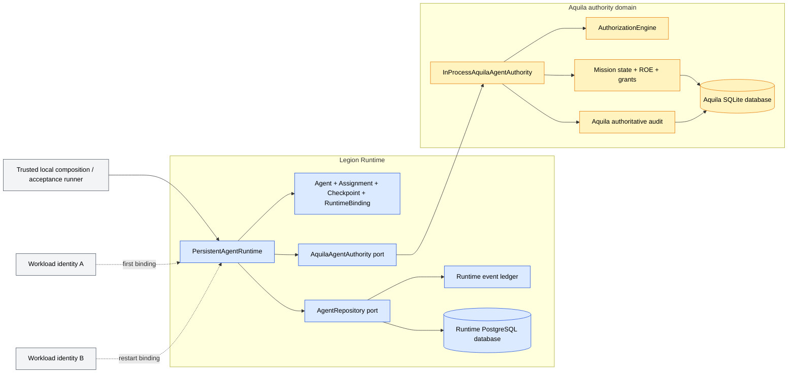
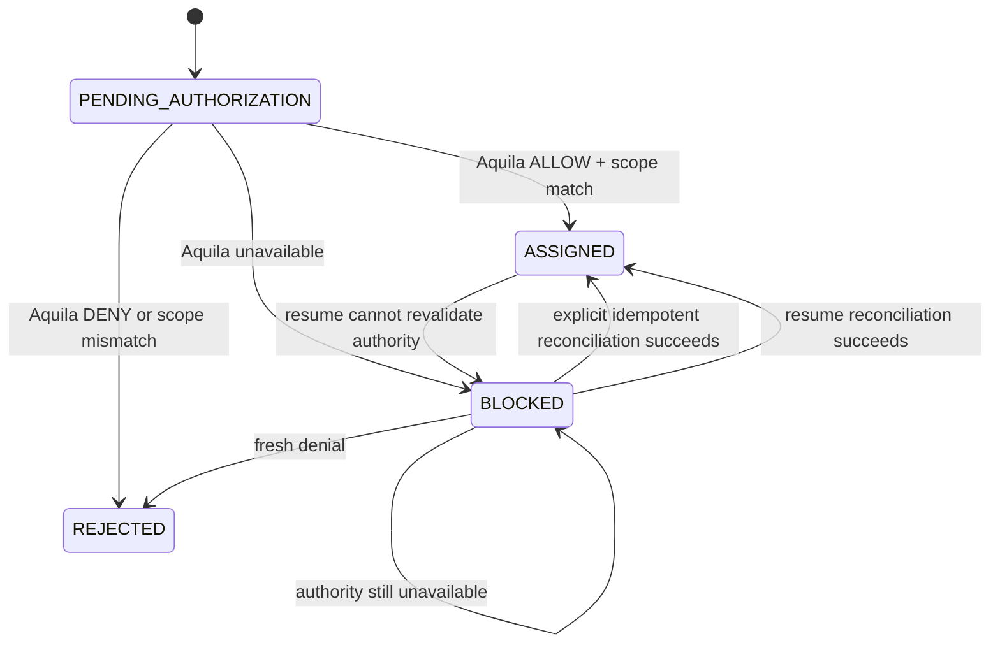

# Phase 1 — First Persistent Centurion Implementation Plan

Status: amended during implementation; PostgreSQL persistence amendment approved

Persistence amendment: the SQLite/no-new-dependency decisions in this document
are superseded by
[Phase 1 amendment — PostgreSQL persistence for the first Centurion](phase-1-postgresql-amendment.md).
The accepted Agent, authority, recovery, and behavioral scope remains in force.

Planning baseline: accepted Phase 0 reconciliation at repository commit `5d095e4`, including the separately identified pre-existing working-tree checkpoint

Planning date: 2026-09-17

Implementation baseline selected: current shared working tree on `pr/71-ai-box-setup` at `5d095e4`; all pre-existing modified and untracked paths remain user-owned and must be preserved. Baseline gates: 138 unit tests and 7/7 M1 scenarios passing on 2026-09-17.

## 1. Delivery intent

Phase 1 will prove the first persistent organizational Agent in Pantheon Legion:

> A Centurion remains the same Agent, assigned to the same Mission with the same outstanding coordination checkpoint, after its Runtime process and workload identity are replaced.

This advances the Legion North Star by establishing the durable organizational identity that later cognition, delegation, evidence gathering, and execution can serve. It deliberately does not attempt to make the Centurion intelligent yet. The implementation must prove that an Agent is an identity rather than a model call, prompt, process, credential, execution record, or workflow.

### Desired outcome

At the end of Phase 1, a deterministic, local-first acceptance scenario can:

1. create a persistent Centurion identity under an Organization and Workspace;
2. request and authorize assignment of that Centurion to an existing Aquila Mission;
3. persist a bounded coordination checkpoint owned by Legion Runtime;
4. destroy all Runtime service and repository objects;
5. reconstruct them from a Runtime-owned PostgreSQL database;
6. bind a new ephemeral workload identity to the same Centurion;
7. revalidate current Mission authority through Aquila;
8. resume from the same checkpoint without duplicating the Agent, assignment, checkpoint, or meaningful events; and
9. remain durably blocked, without inventing authority, when Aquila is unavailable or denies the operation.

### North Star contribution

Phase 1 proves the identity and recovery foundation for one effective persistent Centurion. It does not optimize the existing Mission administration surface or add generic infrastructure. It creates the smallest durable seam from which later phases can add dynamic coordination while Aquila remains the authority plane.

## 2. Scope and non-goals

### In scope

- one persistent Agent role: `CENTURION`;
- Organization/Workspace ownership of Agent identity;
- one active Mission assignment per Centurion for this phase;
- a structured, bounded coordination checkpoint;
- explicit mapping from persistent Agent to ephemeral workload/runtime binding;
- a Runtime-owned repository and append-only Runtime event ledger;
- idempotent create, assignment, reconciliation, and resume operations;
- a narrow Legion Runtime → Aquila authority port;
- Aquila authorization and audit facts for Agent assignment and Runtime resume;
- restart, unavailable-authority, denial, scope, duplicate, and concurrency tests;
- a dedicated Phase 1 behavioral acceptance runner;
- glossary, ADR, Runtime documentation, and handoff updates required by the implemented contract.

### Explicit non-goals

- no LLM, model provider, LangGraph graph, prompt, memory, or cognition request;
- no Scout, Cohort, Century, Task Force, or multi-Agent topology;
- no task decomposition, delegation of work, planning, or dynamic coordination loop;
- no automatic background worker, queue, lease renewal, scheduler, or workflow provider;
- no Cognition Fabric, Resource Fabric, or production Fabrica work;
- no Praetorium feature or public Agent HTTP API;
- no changes to Mission lifecycle, Mission command types, Approval semantics, ROE, or existing DelegationGrant semantics;
- no Agent state inside Aquila's Mission snapshot or SQLite tables;
- no production workload attestation, credential broker, or STS deployment;
- no shared database, high-availability topology, or additional persistence domain;
- no support for multiple simultaneous Mission assignments per Agent;
- no production deployment wiring.

Phase 1 is complete only when persistence and recovery behavior are demonstrated. Defining classes or creating rows without the restart proof is insufficient.

## 3. Authoritative inputs and prerequisite decisions

### Governing sources

1. Current human direction.
2. Root `AGENTS.md`.
3. Accepted Phase 0 reconciliation and its Claude Code review.
4. Accepted ADR-001/002/003 where compatible with the current Agent invariant.
5. Current Mission, authorization, and approval contracts.
6. Existing implementation and tests as current-state evidence.

### Decisions made by this plan

| Topic | Phase 1 decision | Reason |
|---|---|---|
| Agent ownership | Legion Runtime owns Agent identity, assignment, checkpoint, binding, and Runtime lifecycle events. | These answer “who should do the work and what intent survives,” not “may it happen.” |
| Mission ownership | Aquila remains the only owner of Mission state, ROE, grants, approvals, and Mission-authoritative audit. | Preserves the primary authority boundary. |
| Agent scope | Every Agent is owned by one Organization and Workspace. | Prevents cross-tenant assignment and matches Mission ownership boundaries. |
| Assignment cardinality | One active Mission assignment per Centurion in Phase 1. | Proves the capability without deciding the long-term one-to-many model. The constraint must be documented as phase-local. |
| Runtime storage | A dedicated Runtime repository in `legion_runtime`, backed by a separate PostgreSQL database. | Makes ownership visible and prevents Agent state from entering Aquila or Tabula persistence. |
| Authority | Assignment and resume must receive a fresh Aquila decision through a narrow port. | Runtime cannot authorize itself; simple Mission read access is too weak for assignment. |
| Workload mapping | Runtime persists an inspectable binding record containing identity references, never credentials or tokens. | Proves Agent continuity across workload replacement without turning Agent into a credential. |
| Recovery | Explicit, idempotent reconciliation methods; no background loop. | Satisfies failure behavior without prematurely introducing workflow infrastructure. |
| Checkpoint | One typed resumption marker, not an arbitrary prompt/context blob or static workflow DAG. | Preserves dynamic-coordination flexibility while making restart behavior testable. |
| Public surface | No HTTP or Praetorium exposure in this phase. | The product capability is persistence, not UI/API breadth. |
| Dependencies | SQLAlchemy Core, Alembic, and psycopg behind the Runtime repository port. | Matches Tabula's proven local PostgreSQL shape without coupling domain types to persistence infrastructure. |

### Implementation-start prerequisites

Before production files are changed:

1. commit or otherwise preserve the accepted Phase 0 artifacts;
2. decide the implementation branch baseline—clean merged `main` is preferred; do not silently layer Phase 1 over unresolved deployment changes;
3. record the baseline unit and M1 acceptance counts at that commit;
4. create and accept ADR-004, described below, before domain code is merged; and
5. keep any unmerged AI-box deployment work isolated from the Phase 1 diff.

The baseline choice is a human workflow decision. It does not change the architecture in this plan.

## 4. Current implementation seams to reuse

| Existing asset | Phase 1 use | Must not become |
|---|---|---|
| `legion_kernel.Principal` | Authenticated human/workload input and actor reference at the Aquila boundary | Agent identity |
| `AuthorizationEngine` and `AuthorizationRequest` | Aquila evaluation of `ASSIGN_AGENT` and delegated Runtime resume | Runtime-owned policy or self-authorization |
| `DelegationGrant` | Existing bounded workload authority for a resume/read check | Work assignment or Agent identity |
| `AquilaService` / `PersistentAquilaService` | In-process implementation behind the new authority port | Centurion coordinator |
| `LegionKernel` audit helpers and SQLite audit persistence | Mission-authoritative authorization facts | Storage for Runtime checkpoint or bindings |
| `SQLiteMissionStore` patterns | Transaction, compare-and-swap, idempotency, restart-test patterns | A shared Agent/Mission repository |
| `legion_runtime` package | Correct home for the new Agent domain and application service | A renamed workflow provider |
| `DurableExecutionAdapter` | No Phase 1 runtime use; retain unchanged as an execution-attempt contract | Agent store, assignment state, or Centurion identity |
| Existing M1 acceptance suite | Regression gate | A test suite whose scenarios are rewritten to claim Phase 1 |

The existing `Principal.roles` vocabulary (`MISSION_OWNER`, `OPERATOR`, and related roles) remains the authorization input. The distinct `Participant.role` vocabulary is an existing Mission projection concern and is not used to authorize Agent assignment or changed in Phase 1.

## 5. Proposed Phase 1 architecture



This is a logical boundary, not a service-splitting requirement. The acceptance
composition may run both domains in one process while Aquila uses its existing
SQLite store and Runtime uses its separately owned PostgreSQL database.

## 6. Domain model

### Agent identity

Introduce `AgentIdentity` in Legion Runtime with only durable organizational fields:

| Field | Type/constraint | Meaning |
|---|---|---|
| `agent_id` | UUID string, immutable | Stable organizational identity |
| `organization_id` | UUID string, immutable | Owning Organization |
| `workspace_id` | UUID string, immutable | Owning Workspace |
| `display_name` | non-empty, bounded string | Human-readable identity |
| `role` | `AgentRole.CENTURION` | Organizational role, not a permission grant |
| `status` | `AgentStatus.ACTIVE` in Phase 1 | Lifecycle projection; no extra transitions yet |
| `version` | integer beginning at 1 | Optimistic-concurrency revision |
| `created_by` | actor type + stable subject reference | Provenance, not inherited authority |
| `created_at`, `updated_at` | UTC timestamps | Lifecycle provenance |

The type must contain no model, prompt, package, runtime, workflow, process, container, machine, credential, token, grant, endpoint, or hardware field.

`AgentRole` begins with one value, `CENTURION`. `AgentStatus` begins with one usable state, `ACTIVE`. Additional roles and lifecycle transitions require demonstrated behavior rather than speculative enumeration.

### Mission assignment

Introduce `MissionAssignment`:

| Field | Type/constraint | Meaning |
|---|---|---|
| `assignment_id` | UUID string, immutable | Stable Runtime-owned assignment |
| `agent_id` | FK/reference to Agent | Assigned persistent identity |
| `mission_id` | UUID string | Aquila Mission reference |
| `status` | typed state below | Current assignment/reconciliation state |
| `mission_version` | nullable integer | Last Aquila version observed under authority |
| `authorization_decision_id` | nullable opaque reference | Latest Aquila decision |
| `policy_version` | nullable string | Policy version for explainability |
| `requested_by` | actor reference | Originator of assignment intent |
| `correlation_id` | UUID string | Cross-domain correlation |
| `last_error_code` | nullable stable code | Safe recovery/denial reason |
| `version` | monotonic integer | Runtime CAS revision |
| timestamps | UTC | Request and update provenance |

Assignment state:



`REJECTED` is terminal for that assignment request. A materially different request uses a new idempotency key and assignment.

Phase 1 permits one active (`PENDING_AUTHORIZATION`, `BLOCKED`, or `ASSIGNED`) assignment per Agent. It must not imply that long-term Centurions can never coordinate multiple Missions.

### Coordination checkpoint

Introduce one `CoordinationCheckpoint` per assignment:

| Field | Constraint | Meaning |
|---|---|---|
| `assignment_id` | primary reference | Assignment this checkpoint resumes |
| `revision` | monotonic integer | Checkpoint CAS token |
| `state` | `WAITING_FOR_AUTHORITY`, `READY`, or `BLOCKED` | Resume posture |
| `next_intent` | `AUTHORIZE_ASSIGNMENT` or `ASSESS_MISSION` | Bounded next organizational intent |
| `last_observed_mission_version` | nullable integer | Current-state reference, not Mission ownership |
| `correlation_id` | UUID string | Operational correlation |
| `last_error_code` | nullable stable code | Explainable fail-closed state |
| `updated_at` | UTC timestamp | Recovery evidence |

The checkpoint must not contain hidden reasoning, chat history, model context, credentials, raw evidence, tool output, or a serialized workflow graph. `ASSESS_MISSION` is a resumption marker only; Phase 1 never performs the assessment.

### Runtime binding

Introduce `AgentRuntimeBinding` to prove that one Agent survives replacement of its execution identity:

| Field | Constraint | Meaning |
|---|---|---|
| `binding_id` | UUID string | One Runtime/workload incarnation |
| `agent_id`, `assignment_id` | stable references | Identity and work being resumed |
| `workload_subject` | stable authenticated subject | Ephemeral workload identity reference |
| `grant_id` | nullable opaque reference | Aquila grant reference; never a token |
| `status` | `PENDING_AUTHORITY`, `ACTIVE`, `BLOCKED`, `RELEASED` | Binding state |
| `started_at`, `ended_at` | UTC timestamps | Incarnation history |
| `correlation_id` | UUID string | Resume correlation |
| `last_error_code` | nullable stable code | Safe denial/unavailability reason |

Only one binding may be `ACTIVE` for an assignment. Successful resume releases the prior active binding and activates the new one atomically. Tokens, secrets, role claims, model identifiers, process IDs, and host identifiers are not persisted.

### Runtime events

Persist meaningful, append-only Runtime-owned events:

- `AgentCreated`
- `AgentAssignmentRequested`
- `AgentAssigned`
- `AgentAssignmentRejected`
- `AgentRecoveryBlocked`
- `AgentRuntimeBound`
- `AgentResumed`

Every event includes `event_id`, per-Agent sequence, `agent_id`, optional Mission/assignment/binding references, actor reference, result, timestamp, `correlation_id`, optional `causation_id`, and a bounded metadata object. Replays return the original result and do not emit duplicate meaningful events.

These events explain Runtime state. Aquila separately records authority decisions; neither ledger becomes a copy of the other.

## 7. Runtime interfaces

The exact Python names may change during implementation review, but responsibility and information flow must remain stable.

### Aquila authority port

```python
class AquilaAgentAuthority(Protocol):
    def authorize_assignment(
        self,
        *,
        actor: Principal,
        agent: AgentIdentity,
        mission_id: str,
        correlation_id: str,
    ) -> MissionAuthorityView: ...

    def authorize_resume(
        self,
        *,
        workload: Principal,
        delegation_id: str,
        agent_id: str,
        mission_id: str,
        correlation_id: str,
    ) -> MissionAuthorityView: ...
```

`MissionAuthorityView` is a minimal immutable projection: Mission ID, Organization ID, Workspace ID, lifecycle status, Mission version, ROE revision, authorization decision ID, policy version, and evaluation timestamp. It excludes objective text, constraints, artifacts, and other context not needed for identity recovery.

The port distinguishes:

- allowed decision;
- denied decision with stable code; and
- authority unavailable/indeterminate.

Unavailable or indeterminate authority always fails closed.

### Runtime repository port

The repository interface supports:

- atomic transaction scope;
- create/get Agent with optimistic versioning;
- create/get/update assignment;
- get/update checkpoint with revision CAS;
- create/update/list Runtime bindings;
- append/list Runtime events with sequence validation;
- get/put idempotency records;
- list recoverable assignments for one Agent.

The application service must depend on this protocol, not directly on SQLite.

### Persistent Runtime service

`PersistentAgentRuntime` exposes only the Phase 1 application operations:

1. `create_centurion(..., idempotency_key)`
2. `request_assignment(..., idempotency_key)`
3. `reconcile_assignment(assignment_id, actor, idempotency_key)`
4. `resume_assignment(..., workload, delegation_id, idempotency_key)`
5. read methods for Agent, assignment, checkpoint, binding history, and Runtime events
6. `close()`

There is no generic command bus, plugin system, workflow graph, task manager, or model hook.

## 8. Aquila changes

### Assignment authorization

Add an internal Aquila operation `ASSIGN_AGENT`.

- Implement a dedicated `AuthorizationEngine._evaluate` branch after the terminal-Mission check and before generic operation fallthrough.
- Classify it as an authority-only organizational control operation, not a Mission read and not a consequential external side effect.
- Do not obtain its result by passing the default `side_effect_class="READ"` through the generic fallback.
- Human `MISSION_OWNER` or `OPERATOR` may request it for a non-terminal Mission.
- `OBSERVER`, `APPROVER` without an operator role, workload, system, and external principals are denied unless a future explicit policy says otherwise.
- The evaluation uses current Mission state and policy.
- Aquila returns only the minimal authority view.
- Aquila records an `AGENT_ASSIGNMENT_AUTHORIZATION_EVALUATED` fact containing Agent/assignment references, decision ID, policy version, reason, actor, correlation, and Mission version.
- The event does not advance Mission version and does not store Runtime checkpoint state.

### Resume authorization

Resume uses the existing workload and `DelegationGrant` mechanics:

- caller must be `PrincipalType.WORKLOAD`;
- grant subject and Mission must match;
- grant must be current, unrevoked, and contain `READ_MISSION`;
- Aquila records an `AGENT_RUNTIME_AUTHORIZATION_EVALUATED` fact with Agent/binding references and grant ID;
- Runtime treats denial or unavailability as blocked and performs no coordination work.

Phase 1 does not issue grants automatically. Tests explicitly issue a bounded grant through the existing Aquila API. The Runtime receives only a grant ID reference and never a credential.

### Persistence composition

`PersistentAquilaService` must atomically persist each new Aquila audit fact using its existing store transaction pattern. No Agent, assignment, checkpoint, binding, or Runtime event table is added to Aquila.

No new HTTP route or OpenAPI operation is required. The in-process adapter is sufficient for the Phase 1 proof.

### Adapter dependency direction

`aquila_api.runtime_authority` imports and implements the consumer-owned port from `legion_runtime.authority`. This is intentional dependency inversion: Aquila supplies authority decisions to Runtime but does not import Runtime's service, repository, domain coordination, or checkpoint logic. ADR-004 must distinguish this adapter edge from the pre-existing temporary coupling in which Aquila persists a `DurableExecutionAdapter` snapshot.

## 9. Persistence design

### Physical boundary

Use `PostgreSQLAgentStore` in `legion_runtime/postgres.py`. Acceptance tests use
an explicit Runtime test database URL distinct from Aquila and every Tabula
database.

The initial schema contains:

- `agents`
- `mission_assignments`
- `coordination_checkpoints`
- `runtime_bindings`
- `runtime_events`
- `runtime_idempotency`

Use explicit columns for indexed identity, scope, status, version, timestamps, and correlation fields. A bounded JSON column may hold event metadata and idempotency results; do not store the primary Agent/assignment/checkpoint state as an opaque JSON blob.

### Required database invariants

- foreign keys enforced;
- aggregate-scoped transaction advisory locks;
- Agent ID primary key;
- unique active assignment per Agent for Phase 1;
- one active assignment per Agent; rejected historical assignments may retain
  the same Mission reference for an explicitly new request;
- one checkpoint per assignment;
- one active binding per assignment;
- monotonically increasing Agent, assignment, checkpoint, and event revisions/sequences;
- unique idempotency scope/operation/key;
- all state plus its Runtime event and idempotency outcome commit atomically;
- compare-and-swap conflicts fail without partial writes.

Use explicit Alembic migrations. Repository construction must neither create
nor upgrade schema, and an unmigrated database must fail clearly.

### Idempotency

Every state-changing Runtime operation accepts a caller-provided key. Store:

- operation name;
- stable scope;
- key;
- canonical request fingerprint;
- serialized safe result reference.

Same key plus same canonical request returns the original result. Same key plus a different actor, Agent, Mission, workload subject, grant reference, or payload returns `IDEMPOTENCY_KEY_REUSE`.

Idempotency results store stable resource references, not a frozen copy of mutable assignment status. A replay resolves the reference and returns the current durable projection, so a request first observed as blocked can later report its reconciled state without changing request identity.

## 10. Control flows

### Create Centurion

1. Validate UUIDs, display name, actor reference, and idempotency key.
2. Check Runtime idempotency.
3. Create `AgentIdentity` with a generated UUID and version 1.
4. Append `AgentCreated`.
5. Persist Agent, event, and idempotency result atomically.
6. Return the durable Agent.

This is an internal trusted-composition method in Phase 1, not an authorization-free public API. It records creator provenance but grants no Mission access or execution capability. A public organizational Agent-creation authority contract is deferred.

### Request Mission assignment

1. Validate Agent and Mission references and idempotency.
2. Atomically persist:
   - assignment as `PENDING_AUTHORIZATION`;
   - checkpoint as `WAITING_FOR_AUTHORITY/AUTHORIZE_ASSIGNMENT`;
   - `AgentAssignmentRequested`;
   - idempotency result.
3. Call the Aquila authority port outside the Runtime transaction.
4. On allow, verify Agent Organization/Workspace equals the Mission authority view.
5. Atomically CAS assignment/checkpoint:
   - `ASSIGNED`;
   - `READY/ASSESS_MISSION`;
   - observed Mission version and decision references;
   - append `AgentAssigned`.
6. On Aquila unavailability, set `BLOCKED`, retain the authorization intent, append one `AgentRecoveryBlocked`, and return a blocked result.
7. On deny or scope mismatch, set `REJECTED`, append `AgentAssignmentRejected`, and perform no Mission mutation.

Persisting intent before the cross-domain call ensures a crash cannot erase the requested assignment. Reconciliation safely repeats the read/decision because it causes no external effect.

### Reconcile assignment

1. Load assignment and checkpoint.
2. Return the current result immediately for `ASSIGNED` or `REJECTED`.
3. Re-evaluate through Aquila using the original authenticated request context supplied by the trusted caller; do not treat stored role claims as fresh authentication.
4. CAS the current version so concurrent reconcilers cannot both transition or duplicate events.
5. Apply the same allow/block/reject rules as assignment.

The implementation must not persist a human bearer token or reconstruct an authenticated Principal from database claims. The caller supplies a freshly authenticated actor when reconciliation of initial assignment requires it.

### Resume after Runtime replacement

1. Reopen `PostgreSQLAgentStore` and load the Agent, assignment, and checkpoint.
2. Create or replay a `PENDING_AUTHORITY` binding for the newly authenticated workload subject and caller key.
3. Call Aquila `authorize_resume` with that workload and a caller-supplied grant ID.
4. On allow and matching Mission scope:
   - atomically release the previous active binding;
   - activate the new binding;
   - return assignment to `ASSIGNED`;
   - return checkpoint to `READY/ASSESS_MISSION` without changing its organizational intent;
   - append `AgentRuntimeBound` and `AgentResumed` once.
5. On unavailability or indeterminate authority:
   - mark the binding and assignment/checkpoint blocked;
   - retain the same Agent and outstanding intent;
   - append one correlated `AgentRecoveryBlocked`;
   - do not call cognition, tools, or Mission mutation.
6. On denial:
   - block the binding and assignment;
   - record the safe denial code;
   - require explicit retry with current authority; never issue a grant or broaden the request.

## 11. Failure, recovery, and concurrency matrix

| Failure/race | Required durable outcome | Verification |
|---|---|---|
| Runtime dies after Agent insert but before response | Replay returns same Agent; one `AgentCreated` event | Failure injection around commit/response |
| Runtime dies after pending assignment commit but before Aquila call | Assignment remains recoverable with authorization intent | Reopen DB, reconcile |
| Aquila unavailable | Assignment/checkpoint/binding are blocked; no active new binding or self-grant | Unavailable fake then healthy retry |
| Aquila denies assignment | Assignment is rejected; Mission and Agent identity unchanged | Observer/terminal Mission tests |
| Aquila allows but Runtime write fails | Pending/blocked intent remains; retry re-evaluates and commits once | Store failure injection |
| Agent and Mission scopes differ | Reject with `SCOPE_MISMATCH`; no Agent scope rewrite | Cross-workspace test |
| Two identical assignment requests race | One assignment/event; both observe same durable result | Two store/service instances |
| Same idempotency key, different request | `IDEMPOTENCY_KEY_REUSE`; no partial state | Unit and acceptance |
| Two resume attempts race | At most one active binding; loser reloads or receives conflict | Concurrent store instances |
| Runtime dies inside the binding-swap transaction | Entire swap rolls back; the old binding remains active and retry can safely repeat | Failure injection inside transaction, then reopen |
| Assignment reconciliation races Runtime resume | First CAS transition wins; loser reloads current assignment/checkpoint and cannot overwrite or create a second active binding | Cross-operation two-instance race test |
| Process restarts with different workload | Same Agent/assignment/checkpoint; new binding subject; old binding released | Primary acceptance scenario |
| Grant expired/revoked/mismatched | Resume blocked with Aquila reason; no work performed | Existing grant machinery plus Runtime assertion |
| Mission terminal between assignment and resume | Resume denied/blocked; identity remains inspectable | Terminal Mission test |
| Runtime event append fails | Associated state/idempotency write rolls back | Transaction failure injection |

No Phase 1 operation performs an external consequential action, so exactly-once external effects are not claimed.

## 12. Security and trust boundaries

- Runtime never interprets Agent role as permission.
- Runtime cannot manufacture an Aquila allow decision or DelegationGrant.
- Agent ownership scope must match Mission ownership scope.
- Human/workload authentication remains outside the Runtime domain service; callers pass authenticated principals.
- Stored actor references are provenance only and are never replayed as fresh credentials.
- Workload roles, tokens, private keys, bearer credentials, prompts, and raw Mission content are not persisted in Runtime state.
- Grant IDs and decision IDs are opaque references, not authority by themselves.
- Aquila unavailability and malformed responses fail closed.
- Runtime database corruption or unsupported schema version fails closed rather than silently rebuilding identity.
- The in-process adapter does not imply that the trust boundary may be bypassed when the domains later run in separate processes.

## 13. Observability and explainability

For a successful restart, an operator must be able to reconstruct:

- stable `agent_id`;
- Mission and assignment IDs;
- original human requester;
- old and new workload subjects/binding IDs;
- Aquila decision and grant references;
- checkpoint before and after restart;
- correlation/causation chain;
- whether replay or fresh work occurred;
- denial/unavailability reason when blocked.

No hidden chain-of-thought or model reasoning is recorded. Phase 1 observability is domain state plus meaningful events, not a telemetry platform.

## 14. File-level implementation plan

| Path | Planned change |
|---|---|
| `docs/adr/ADR-004-persistent-agent-identity.md` | Record Agent identity/ownership, Agent vs workload/runtime/model distinction, Runtime ownership, assignment authority, adapter dependency direction, alternatives, and consequences. Clarify rather than rewrite ADR-001 history. |
| `docs/domain-glossary.md` | Replace the obsolete “Agent is a capability-bearing workload” definition; distinguish Agent, Agent role, Agent package/version, Runtime binding, workload identity, run, and Mission assignment. |
| `legion_runtime/agent.py` | Add the pure domain types and validation for Agent, assignment, checkpoint, binding, events, and stable error codes. |
| `legion_runtime/authority.py` | Define `AquilaAgentAuthority`, `MissionAuthorityView`, denial result, and unavailable error without importing Aquila implementation. |
| `legion_runtime/repository.py` | Define repository protocol and conflict/sequence/idempotency errors. |
| `legion_runtime/database.py` | Define the SQLAlchemy Core schema without making persistence rows the domain model. |
| `legion_runtime/postgres.py` | Implement Runtime-owned PostgreSQL transactions, aggregate locks, CAS, event sequencing, idempotency, and restart reads. |
| `legion_runtime/alembic/` | Own explicit, reviewable Runtime database migrations. |
| `docker-compose.yml` | Run the separately owned local PostgreSQL 16 Runtime database with health check and durable volume. |
| `legion_runtime/service.py` | Implement create, assignment, reconciliation, resume, and read operations against the ports. |
| `legion_runtime/__init__.py` | Export the supported Phase 1 contract while retaining existing durable-execution exports. |
| `legion_runtime/README.md` | Document ownership, composition, recovery, and the difference between Agent state and `DurableExecutionAdapter`. |
| `aquila_api/authorization.py` | Add a dedicated `ASSIGN_AGENT` branch with explicit operator/owner and non-terminal semantics; do not rely on generic `READ` fallthrough. Retain existing workload grant semantics for resume. |
| `aquila_api/service.py` | Add narrow internal assignment/resume authorization methods returning safe views and recording decision facts; do not orchestrate Runtime state. |
| `aquila_api/persistent.py` | Persist the new Aquila audit facts atomically using existing patterns. |
| `aquila_api/runtime_authority.py` | Implement the in-process Runtime authority port adapter around Aquila methods. |
| `aquila_api/__init__.py` | Export the adapter if it is part of the supported in-process composition. |
| `legion_kernel/kernel.py` | Add narrowly scoped audit-recording helpers only; do not add Agent aggregate/state. |
| `tests/test_agent_domain.py` | Validate identity separation, field bounds, transitions, and scope invariants. |
| `tests/test_agent_store.py` | Validate PostgreSQL round trips, atomicity, CAS, idempotency, event ordering, explicit migration behavior, and concurrent writers. |
| `tests/test_agent_runtime.py` | Validate application flows with deterministic allow/deny/unavailable authority fakes. |
| `tests/test_aquila_agent_authority.py` | Validate operator/owner allow, observer/workload denial, grant checks, terminal Mission behavior, safe view, and Aquila audit. |
| `tests/test_persistent_centurion.py` | End-to-end two-database restart, workload replacement, blocked recovery, and no-duplication behavior. |
| `tests/acceptance/phase1-persistent-centurion.yaml` | Catalog Phase 1 scenarios and required evidence. |
| `tests/acceptance/phase1_runner.py` | Produce reproducible scenario-level evidence without changing the M1 runner. |
| `tests/acceptance/README.md` | Document the separate Phase 1 command and expected evidence. |
| `docs/handoff.md` | After acceptance, record the exact baseline, implemented capability, test counts, commands, known limits, and next safe slice. |

The list is a reviewable implementation map. If implementation evidence shows a file can be omitted without weakening the contracts or tests, remove it and record the plan amendment; do not create empty abstractions to satisfy this table.

## 15. Implementation sequence and validation gates

### Stage 0 — establish clean delivery baseline

- preserve Phase 0 artifacts;
- select/record the branch baseline;
- run unit and M1 acceptance suites;
- record pre-existing working-tree changes.

Gate: a reviewer can distinguish the Phase 1 diff from prior deployment work.

### Stage 1 — reconcile vocabulary and architecture decision

- add ADR-004;
- update glossary terms;
- define exact Phase 1 invariants and non-goals.

Gate: “Agent,” “workload identity,” “runtime binding,” “run,” and “model” cannot be read as synonyms.

### Stage 2 — implement pure Runtime domain and repository

- add domain types, repository protocol, and SQLite store;
- implement validation, CAS, idempotency, event ordering, and transactions;
- add domain/store tests.

Gate: Agent, assignment, checkpoint, bindings, and events survive repository reconstruction with no Aquila dependency.

### Stage 3 — implement Runtime service with authority fakes

- add create, assignment, reconciliation, and resume flows;
- cover allow, deny, unavailable, scope mismatch, replay, and concurrent calls.

Gate: all Runtime behaviors pass with deterministic ports; no production Aquila coupling is hidden in domain types.

### Stage 4 — add Aquila authority adapter

- add `ASSIGN_AGENT` decision semantics;
- add delegated resume validation;
- persist correlated decision facts;
- prove no Agent state enters Aquila.

Gate: Runtime cannot reach `ASSIGNED` or activate a binding without an Aquila allow decision.

### Stage 5 — behavioral acceptance

- compose persistent Aquila and Runtime with distinct persistence stores;
- execute restart/workload-replacement scenarios;
- inspect state and both event ledgers;
- run failure/recovery and concurrency cases.

Gate: all Phase 1 acceptance criteria pass with reproducible evidence.

### Stage 6 — documentation, self-evaluation, and independent review

- update READMEs/handoff;
- run full tests and formatting checks;
- evaluate every acceptance criterion;
- prepare a Claude Code review package;
- remediate blocker/major findings and re-review as required.

Gate: independent reviewer concludes `ACCEPT`.

## 16. Test and evidence strategy

### Required test layers

1. **Domain tests** — values, transitions, invariants, no identity conflation.
2. **Repository tests** — real temporary SQLite, close/reopen, CAS, atomic rollback, idempotency, event sequence.
3. **Service tests** — fake authority responses and failure injection.
4. **Aquila integration tests** — real policy, grants, Mission status, and persistent audit.
5. **Behavioral acceptance** — real persistent Aquila + Runtime stores, object destruction/recreation, changed workload identity.
6. **Regression** — existing unit suite and unchanged seven-scenario M1 runner.

### Evidence commands

Exact interpreter paths are re-established at implementation start. Expected commands:

```sh
/tmp/pantheon-legion-venv/bin/python -m unittest discover -s tests -v
/tmp/pantheon-legion-venv/bin/python -m tests.acceptance.runner
/tmp/pantheon-legion-venv/bin/python -m tests.acceptance.phase1_runner
git diff --check
```

The implementation report must include test counts from the selected baseline rather than assuming the current dirty-checkpoint count remains authoritative.

## 17. Acceptance criteria

| ID | Criterion | Required evidence |
|---|---|---|
| P1-AC-01 | Creating a Centurion produces a durable stable `agent_id`, scope, role, and status; identity contains no model/prompt/process/runtime/credential/hardware coupling. | Domain contract inspection, SQLite round trip, serialized acceptance evidence |
| P1-AC-02 | Assignment to an existing Mission durably records assignment plus bounded checkpoint under Runtime ownership. | Two-database inspection and assignment/checkpoint events |
| P1-AC-03 | Destroying and recreating Runtime/repository objects restores the identical Agent, assignment, and checkpoint revisions. | Acceptance restart scenario |
| P1-AC-04 | Resume uses a new workload/binding identity while retaining the same Agent identity; the mapping history is inspectable. | Before/after binding evidence |
| P1-AC-05 | Create, assignment, reconcile, and resume replays are idempotent; key reuse with different input fails and emits no duplicate meaningful event. | Idempotency and event-count assertions |
| P1-AC-06 | Aquila remains authoritative for Mission state/authorization; Runtime has no Mission write contract and no Agent state is stored in Aquila. | Port/API inspection, separate schema inspection, unchanged Mission version |
| P1-AC-07 | Aquila unavailable/deny leaves Runtime durably blocked or rejected, then safe explicit retry resumes after authority returns; Runtime never self-grants. | Failure/recovery acceptance scenarios and grant audit |
| P1-AC-08 | Existing baseline unit tests and seven M1 scenarios remain passing; dedicated Phase 1 acceptance passes. | Recorded commands and outputs |
| P1-AC-09 | Agent and Mission Organization/Workspace mismatch is rejected without rewriting either scope. | Cross-scope test and database inspection |
| P1-AC-10 | Concurrent assignment/resume attempts preserve one active assignment/binding and atomic Runtime event/idempotency state. | Two-connection race tests |
| P1-AC-11 | Aquila and Runtime record correlated, bounded facts sufficient to explain assignment and restart without raw Mission/model/tool content. | Ledger inspection keyed by correlation ID |
| P1-AC-12 | No public HTTP/UI surface, cognition, Scout, scheduler, tool execution, or new dependency is introduced. | Diff/dependency review |

P1-AC-01 through P1-AC-08 preserve the accepted Phase 0 criteria. P1-AC-09 through P1-AC-12 make scope, concurrency, explainability, and non-goals testable rather than implicit.

## 18. Initial plan self-critique

### Objective alignment

**Finding:** A tempting plan would move Scout orchestration out of Aquila at the same time. That would make the diff look architecturally ambitious but would not strengthen the identity proof.

**Correction:** Phase 1 introduces only the identity/assignment boundary. Existing Scout and cognition paths remain untouched and explicitly historical until a later slice can move them onto a proven Agent foundation.

### Identity correctness

**Finding:** Reusing `Principal`, `Participant`, `ExecutionRecord`, or `AgentInstance` as the Agent record would be locally convenient and architecturally wrong.

**Correction:** `AgentIdentity` is a distinct Runtime aggregate. Principals and bindings reference it but cannot substitute for it.

### Authority

**Finding:** Reusing `READ_MISSION` as assignment permission would allow observers to assign Agents. Checking human roles inside Runtime would make Runtime a second authority engine.

**Correction:** Add a dedicated Aquila `ASSIGN_AGENT` branch after the terminal-state gate. Treat it as an organizational control decision rather than borrowing generic `READ` side-effect semantics; Runtime receives the decision through a port and never evaluates the role itself.

### Cross-domain consistency

**Finding:** Calling Aquila before persisting assignment intent creates a crash
window in which human intent disappears. Trying to atomically commit across
the separately owned Runtime PostgreSQL and Aquila databases would introduce
distributed-transaction machinery.

**Correction:** Persist `PENDING_AUTHORIZATION` first, then reconcile an idempotent authority decision with CAS. Accept temporary blocked/pending state as explicit normal behavior.

### Scope and tenancy

**Finding:** Storing only `mission_id` on the Agent or assignment would allow accidental cross-Organization/Workspace linkage.

**Correction:** Scope Agent identity and compare it to Aquila's minimal Mission authority view before assignment/resume.

### Checkpoint design

**Finding:** An arbitrary JSON “agent state” blob could quietly become a prompt dump or serialized framework workflow. A detailed fixed DAG would contradict dynamic coordination.

**Correction:** Phase 1 checkpoint is a tiny typed resumption marker with no reasoning or framework state.

### Persistence ownership

**Finding:** Adding Agent tables to `SQLiteMissionStore` or `PersistentAquilaService` would be the easiest implementation but would immediately reproduce Aquila gravity.

**Correction:** Separate Runtime repository and database; only correlated decision references cross the port.

### Failure behavior

**Finding:** Merely reloading an Agent row after restart would not prove safe recovery or workload replacement. Creating the new binding before authority succeeds could leave two apparently active workloads.

**Correction:** Resume is a persisted, authority-gated transition. Old binding release and new binding activation are one Runtime transaction after Aquila allows.

### Security

**Finding:** Persisting a reconstructed `Principal` with roles for later replay would treat stale claims as authentication. Automatically issuing a grant during resume would let Runtime broaden its own authority.

**Correction:** Store only actor/workload references. Require freshly authenticated principals and caller-supplied existing grant IDs for each authority interaction.

### Simplicity

**Finding:** A generic agent registry API, event bus, workflow engine, migration framework, or service split is not required to prove the capability.

**Correction:** One package-owned repository, in-process port, explicit methods, SQLite, and a small acceptance runner.

### Plan-review outcome

**PROCEED TO INDEPENDENT PLAN REVIEW**, not implementation.

The plan is sufficiently specific for adversarial review, but implementation remains blocked until the baseline and ADR prerequisite are resolved as Stage 0/1 work.

## 19. Risks and open decisions

### Risks controlled by this plan

- Agent/workload conflation — controlled by separate types and acceptance inspection.
- Aquila orchestration gravity — controlled by a Runtime-owned service and narrow authority adapter.
- cross-database partial progress — controlled by persisted intent and reconciliation.
- duplicate Agent/binding creation — controlled by idempotency, CAS, and uniqueness.
- stale authority — controlled by fresh assignment/resume decisions.
- secret retention — controlled by reference-only binding records.
- premature framework coupling — controlled by repository isolation and no cognition.

### Decisions intentionally deferred

1. Whether one Centurion may ultimately serve many simultaneous Missions.
2. Agent suspension/retirement and reassignment lifecycle.
3. Public Agent/organization administration authority and APIs.
4. Participant projection of an Agent inside the Mission aggregate.
5. Dynamic plans, tasks, delegation, Scouts, and Task Forces.
6. Background reconciliation/workflow infrastructure.
7. Production workload attestation and credential delivery.
8. Shared-database, replication, and high-availability topology.
9. Runtime telemetry backend and artifact storage.
10. Cognition/Resource Fabric contracts.

Deferring these does not prevent the first persistent identity proof.

## 20. Plan self-evaluation

| Plan requirement | Evidence in this artifact | Result |
|---|---|---|
| Advances North Star | Delivery intent ties identity/restart proof to the first Centurion. | PASS |
| Preserves domain boundaries | Architecture, ownership table, authority port, and separate persistence are explicit. | PASS |
| Smallest useful slice | No cognition, Scouts, UI/API, scheduler, workflow engine, or deployment wiring. | PASS |
| File-level implementable | Section 14 identifies concrete paths and responsibilities. | PASS |
| State and control flow defined | Sections 6, 9, and 10 define durable records, transitions, and ordering. | PASS |
| Failure/recovery explicit | Section 11 covers crash windows, denial, unavailability, replay, and races. | PASS |
| Security/authority explicit | Sections 8 and 12 prohibit self-authorization and credential persistence. | PASS |
| Tests prove capability | Sections 16 and 17 require restart/workload replacement and inspectable evidence. | PASS |
| Existing assets reused | Section 4 preserves current Mission, auth, grant, persistence-pattern, and acceptance assets. | PASS |
| Future flexibility | Provider/model/hardware independence and deferred decisions are explicit. | PASS |

### Did we plan what Phase 0 recommended?

Yes. The plan implements the exact Phase 0 entry slice: stable Centurion identity, Mission assignment, bounded checkpoint, explicit Agent/workload mapping, Aquila authority port, restart continuity, idempotency, and unavailable-authority recovery.

### Would executing this plan prove the intended outcome?

If all acceptance criteria pass, yes. The evidence would show that organizational identity and outstanding intent survive replacement of Runtime objects and workload identity without moving Mission authority into Runtime. It would not yet prove an intelligent or autonomous Centurion, and the implementation report must say so plainly.

### Known planning limitations

- The plan has not selected the implementation branch baseline; the current working tree contains user-owned uncommitted deployment and Phase 0 documentation.
- No production workload authenticator exists, so Phase 1 uses authenticated `Principal` inputs and existing grant semantics in an in-process acceptance composition.
- Agent-creation authority is intentionally not exposed publicly; a future organization administration contract is required before public use.
- The schema names and exact module split may be simplified during implementation if the invariants and acceptance evidence remain intact and the plan amendment is recorded.

## 21. Independent plan review

Claude Code independently read the twelve required sources, verified the proposed seams against the Runtime, kernel, store, Aquila policy/service/persistence, and representative tests, and concluded **ACCEPT** with no `BLOCKER` or `MAJOR` findings.

The reviewer marked all twelve acceptance criteria implementation-feasible. Its strongest challenge traced assignment and resume authorization line by line through `AuthorizationEngine._evaluate`; it confirmed the design but found that the plan had not prevented `ASSIGN_AGENT` from relying on the generic `READ` fallthrough.

| Finding | Classification | Response |
|---|---|---|
| `ASSIGN_AGENT` placement was ambiguous and could silently use generic `READ` fallthrough. | **ACCEPTED — MINOR** | Required an explicit branch with organizational-control semantics, correct ordering, and no reliance on `side_effect_class="READ"`. |
| The `aquila_api → legion_runtime` adapter import could be mistaken for the orchestration coupling identified in Phase 0. | **ACCEPTED — OBSERVATION** | Added an explicit dependency-inversion explanation and made it an ADR-004 requirement. |
| Mid-transaction binding-swap crash was covered by atomicity but absent from the matrix. | **ACCEPTED — OBSERVATION** | Added a failure-injection/reopen row. |
| Reconcile-versus-resume concurrency was covered by CAS but not named as a test. | **ACCEPTED — OBSERVATION** | Added a two-instance cross-operation race row. |
| `Principal.roles` and `Participant.role` use different existing vocabularies. | **ACCEPTED — OBSERVATION** | Clarified that Phase 1 uses Principal authorization roles and does not change Participant projection vocabulary. |

No finding was disputed. The delivery process requires re-review after `BLOCKER` or `MAJOR` remediation; these accepted documentation clarifications do not trigger another independent cycle.

### Final plan acceptance

- Objective alignment: **PASS**
- Architecture and authority boundaries: **PASS**
- Failure, recovery, concurrency, and idempotency design: **PASS**
- Acceptance-test sufficiency: **PASS**
- Scope discipline and local-first operation: **PASS**
- Independent review: **ACCEPT**
- Implementation started: **no**

Phase 1 implementation may begin only after the human selects the clean implementation baseline and Stage 0 records it.
