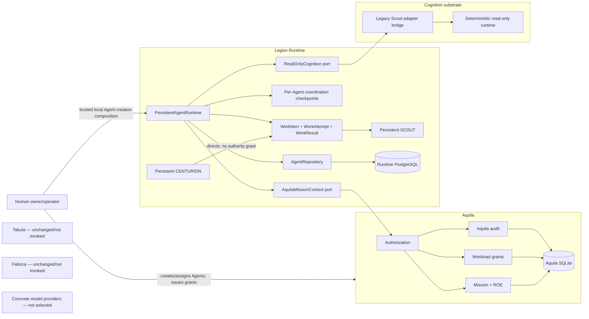

# Phase 2 Plan — First Durable Centurion-to-Scout Work Cycle

- Status: Implemented and independently accepted
- Date: 2026-09-18
- Roadmap namespace: Persistent Organization roadmap, following Phase 0 architecture reconciliation and Phase 1 persistent Centurion
- Implementation status: Complete; independent implementation re-review ACCEPT

## 1. Delivery intent

### Problem

Phase 1 proves that a Centurion is a persistent organizational identity. It can
be assigned to a Mission, retain a bounded `ASSESS_MISSION` checkpoint, survive
Runtime and PostgreSQL restart, and resume through a replacement workload
binding. It cannot yet coordinate another Agent or durably complete even one
piece of organizational work.

The repository already contains a read-only Scout cognition substrate, but its
`ScoutRequest.scout` field is a workload `Principal` and Aquila directly
sequences Mission reads and cognition. Attaching that path directly to the new
Centurion would reproduce the identity conflation and Aquila-orchestration drift
identified in Phase 0.

### Desired outcome

Phase 2 should prove one bounded organizational capability:

> An assigned persistent Centurion can direct one assigned persistent Scout to
> perform a bounded read-only task; a replacement Scout workload can recover
> the same task and Agent identity; one accepted result is durably returned to
> the same Centurion after interruption, without work delegation becoming an
> authority grant or Aquila becoming the coordinator.

The proof includes a provider-neutral cognition request and a deterministic
reference adapter. It does not select or deploy a model provider. The capability
is the durable organizational work cycle, not autonomous intelligence or
production inference.

### North Star contribution

This is the first step in which Legion, rather than a human or Aquila method,
coordinates two persistent organizational identities around a real Mission. It
establishes the identity, delegation, recovery, and explainability semantics on
which later Tabula evidence gathering, model selection, multi-Scout adaptation,
and Fabrica execution depend.

### Success boundary

Phase 2 succeeds only if repository evidence demonstrates the complete cycle:

```text
persistent Centurion binding
  -> durable read-only work item
  -> persistent Scout assignment and binding
  -> fresh Aquila Mission-read authorization/context
  -> provider-neutral cognition attempt
  -> one durable bounded result
  -> Centurion checkpoint ready to assess that result
```

The same task must survive Runtime object destruction and PostgreSQL restart.
It must remain recoverable after authority or cognition unavailability, and a
cancelled task must not be resurrected by a late result.

## 2. Phase naming and scope selection

The older `legion-tabula-platform-plan.md` calls the Tabula read-contract
milestone “Phase 2.” That work is already recorded as completed. In this plan,
**Phase 2** means the next phase in the newer sequence initiated by:

1. Phase 0 — Architecture Reconciliation; and
2. Phase 1 — Persistent Centurion identity.

Implementation and review artifacts must use “Persistent Organization Phase 2”
or “first delegated Scout” when ambiguity is possible.

### Options evaluated

| Option | Value | Problem | Decision |
|---|---|---|---|
| Centurion Mission assessment only | Advances the `ASSESS_MISSION` checkpoint with little schema | Does not establish organizational coordination or resolve Scout identity drift | Defer as part of richer Centurion cognition |
| Durable Centurion-to-Scout work cycle | Proves coordination, persistent Scout identity, recovery, and correct authority separation | Requires a small task/result model and cognition seam | **SELECTED** |
| Full Tabula + model + two-Scout loop | Demonstrates a more impressive user story | Couples four missing boundaries and makes failure attribution ambiguous | Defer |
| Build Cognition and Resource Fabrics first | Creates target infrastructure | No current resource inventory or scheduling use case justifies it | Defer |
| Add Praetorium Agent/task UI first | Makes state visible | Exposes administration before the organizational behavior exists | Defer |

## 3. Scope and explicit non-goals

### In scope

1. Add persistent `SCOUT` as an Agent role without changing the Agent identity invariant.
2. Reuse the Phase 1 Agent, Mission assignment, workload binding, Runtime event,
   idempotency, PostgreSQL, and Alembic foundations.
3. Add a Runtime-owned, Mission-scoped read-only work item delegated by a
   Centurion Agent to a Scout Agent.
4. Add durable claim/attempt/result/cancel/retry state sufficient for one Scout
   task and restart recovery.
5. Require active, matching Centurion and Scout workload bindings when they act.
6. Obtain a fresh, bounded Mission context through a Runtime-owned Aquila port
   before Scout cognition.
7. Add a model-independent cognition request that identifies Agent, workload,
   task, attempt, Mission version, logical capability, and bounded context.
8. Adapt the existing deterministic read-only Scout runtime behind that port.
9. Store one bounded coordination result and evidence references in Runtime;
   keep result bodies out of Runtime events and Aquila audit.
10. Move both Agent checkpoints through the work cycle and emit meaningful,
    correlated Runtime events.
11. Prove interruption, replacement binding, cancellation, stale completion,
    idempotency, and concurrent-claim behavior.

### Explicit non-goals

- no concrete local or cloud model provider;
- no model endpoint, named model, GPU/NPU, or host selection;
- no Cognition Fabric router, health registry, or provider scheduler;
- no Resource Fabric, node registry, placement, queue, or background worker;
- no live Tabula retrieval or Registry discovery in the new Runtime path;
- no Fabrica tool invocation or external mutation;
- no production workload attestation or credential broker;
- no public Agent/task HTTP API or Praetorium UI;
- no Cohort, Century, Task Force, skill marketplace, or generalized topology;
- no multi-Scout fan-out, voting, quorum, debate, or static workflow DAG;
- no change to Mission commands, lifecycle, ROE, Approval semantics, or M1 scenarios;
- no Aquila PostgreSQL migration;
- no claim of exactly-once model/provider invocation;
- no removal of historical Aquila Scout/Tabula methods until their remaining
  callers have a target-owned replacement.

## 4. Governing sources and current-state evidence

### Authoritative sources

1. Current human direction and root `AGENTS.md`.
2. `docs/architecture/phase-0-architecture-reconciliation.md`.
3. `docs/architecture/phase-1-persistent-centurion-plan.md` and its accepted
   PostgreSQL amendment/review package.
4. `docs/adr/ADR-001-mission-root-object.md` through ADR-004.
5. `docs/domain-glossary.md`.
6. Mission, authorization, approval, federation, and cognition contracts.
7. Current implementation and behavioral tests.

### Implemented foundations to preserve

| Foundation | Evidence | Phase 2 use |
|---|---|---|
| Persistent Agent identity | `legion_runtime/agent.py::AgentIdentity` | Add `SCOUT`; retain stable, resource-independent identity |
| Mission assignment/checkpoint | `MissionAssignment`, `CoordinationCheckpoint` | Give each Agent its own authorized Mission relationship and resumption intent |
| Workload replacement | `AgentRuntimeBinding`, `PersistentAgentRuntime.resume_assignment` | Authenticate acting workload by active binding without equating it to the Agent |
| Runtime transaction model | `AgentRepository.transaction`, `PostgreSQLAgentStore` | Aggregate locks, CAS, atomic event/idempotency changes |
| Runtime PostgreSQL | `legion_runtime/database.py`, Alembic revision `0001` | Add explicit `0002` migration; no constructor DDL |
| Aquila authority adapter | `AquilaAgentAuthority`, `InProcessAquilaAgentAuthority` | Extend through a separate minimal Mission-context read port |
| Workload grants | `DelegationGrant`, `READ_MISSION`, issue/revoke persistence | Continue to authorize workload access; never represent work assignment |
| Scout validation | `legion_cognition/scout.py`, conformance matrix | Preserve read-only validation and adapter replaceability |
| Model safety concepts | redaction, bounded retry, digest provenance | Preserve behind the cognition seam; do not select a provider in Phase 2 |
| Correlated audit | Runtime events and Aquila decision events | Explain who directed, claimed, attempted, cancelled, and completed work |
| Acceptance style | M1 and Phase 1 YAML/runners | Add a separate Phase 2 behavioral catalog without rewriting earlier gates |

### Current mismatches this phase must not copy

1. `ScoutRequest.scout` currently represents a Scout as a workload `Principal`.
2. `AquilaService.run_scout` and `run_tabula_scout` currently sequence cognition.
3. The existing Scout result is not durable Runtime coordination state.
4. There is no work/task identity distinct from a Mission assignment or Aquila
   `DelegationGrant`.
5. `NextIntent.ASSESS_MISSION` is Centurion-specific and cannot describe a
   Scout waiting for or executing work.
6. The one-node LangGraph adapter does not demonstrate dynamic coordination and
   must not become the task state machine.

## 5. Architecture decision proposed by Phase 2

Phase 2 should add a proposed ADR before implementation:

> Legion Runtime owns work items and Agent-to-Agent work delegation. Aquila
> owns the authority required for a workload to read Mission state or later
> affect external systems. Work direction is not an authority grant.

Consequences:

- a Centurion may create or cancel Runtime coordination work only through its
  active binding and only for an assigned Scout in the same Mission and tenant;
- the act of assigning work cannot mint, widen, copy, or imply an Aquila grant;
- the Scout still needs its own authenticated workload binding and current
  Aquila delegation before Mission context is supplied;
- task completion does not mutate the Mission or promote knowledge;
- Runtime task events are authoritative for coordination state, while Aquila
  events remain authoritative for authorization and Mission facts;
- cognition receives no Aquila command, grant-management, Tabula, or Fabrica
  interface.

## 6. Proposed target architecture



The in-process composition remains acceptable. The boundaries are logical and
testable; Phase 2 does not require new deployable services.

## 7. Domain model

### Agent role and assignment intent

Add `AgentRole.SCOUT`. `AgentIdentity` gains no model, prompt, framework,
credential, host, capability, or package field.

Agent creation should gain a role-aware internal path while preserving
`create_centurion` as a stable convenience API. A dedicated `create_scout`
method is preferred over exposing an unconstrained public role string.

After authorized assignment:

- a Centurion checkpoint begins at `ASSESS_MISSION`;
- a Scout checkpoint begins at `AWAIT_WORK`.

Phase 2 adds the following bounded next intents:

```text
Centurion: ASSESS_MISSION -> AWAIT_WORK_RESULT -> ASSESS_WORK_RESULT
Scout:     AWAIT_WORK -> EXECUTE_WORK -> AWAIT_WORK
```

The checkpoint should carry an optional `focus_work_item_id`; it must not grow
an arbitrary framework-state or prompt blob.

Phase 1's current `resume_assignment` implementation is Centurion-specific: it
requires `NextIntent.ASSESS_MISSION` and writes that intent again on successful
activation. Phase 2 must make assignment/resume role-aware before any Scout
binding is accepted:

- assignment authorization chooses the initial intent from the Agent role;
- resume validates that the checkpoint intent is legal for that role rather
  than requiring `ASSESS_MISSION`;
- successful resume preserves the checkpoint's current `next_intent` and
  `focus_work_item_id` while refreshing state, Mission version, and error
  metadata;
- a Scout with `EXECUTE_WORK` outstanding resumes to that same intent through
  a replacement binding; and
- existing Centurion Phase 1 behavior remains `ASSESS_MISSION`.

This role-aware correction is a prerequisite, not an implementation detail.

### WorkItem

`WorkItem` is a Runtime-owned, Mission-scoped coordination record. It is not a
Mission, Aquila grant, Approval, workflow node, prompt, or execution authority.

| Field | Constraint / meaning |
|---|---|
| `work_item_id` | Immutable UUID |
| `mission_id` | Existing Aquila Mission reference |
| `centurion_agent_id` | Directing persistent Agent |
| `centurion_assignment_id` | Active source Mission assignment |
| `scout_agent_id` | Assigned persistent Agent |
| `scout_assignment_id` | Active target Mission assignment |
| `objective` | 1..4096 UTF-8 bytes; coordination content, no credential field |
| `required_capabilities` | 1..16 distinct read-only names, each 1..128 characters |
| `status` | Typed lifecycle below |
| `version` | CAS revision |
| `correlation_id` | Stable cross-domain/work-cycle UUID |
| `causation_id` | Optional initiating event/request reference |
| timestamps | Created/updated/cancelled terminal provenance |

Initial statuses:

```text
QUEUED -> CLAIMED -> COMPLETED
                  -> RETRYABLE -> CLAIMED
                  -> FAILED
QUEUED/CLAIMED/RETRYABLE -> CANCELLED
```

No generic dependency graph, arbitrary child list, scheduling priority system,
or workflow expression is added.

### WorkAttempt

Each cognition attempt is separately inspectable:

| Field | Constraint / meaning |
|---|---|
| `attempt_id` | Immutable UUID and stable cognition request ID |
| `work_item_id` | Parent work item |
| `scout_agent_id` | Persistent actor identity |
| `scout_binding_id` | Ephemeral workload incarnation used for this attempt |
| `status` | `PREPARED`, `RUNNING`, `SUCCEEDED`, `FAILED`, `ABANDONED` |
| `attempt_number` | Monotonic per work item |
| `mission_version` | Fresh version observed before cognition, nullable until authorized |
| `authorization_decision_id` | Opaque Aquila reference, nullable until authorized |
| `error_code` | Bounded normalized code only |
| timestamps/version | Recovery and CAS metadata |

An interrupted `PREPARED` or `RUNNING` attempt can be marked `ABANDONED` by an
explicit reconciliation call before a new attempt is prepared. A provider call
may have occurred before a crash; therefore Phase 2 promises at-least-once
cognition attempts and exactly one accepted terminal result, not exactly-once
provider invocation.

### WorkResult

`WorkResult` is a bounded coordination outcome, not a general artifact store.

| Field | Constraint / meaning |
|---|---|
| `result_id` | Immutable UUID |
| `work_item_id`, `attempt_id` | Stable provenance |
| `scout_agent_id`, `scout_binding_id` | Agent/workload distinction |
| `mission_version` | Context version used |
| `summary` | 1..8192 UTF-8 bytes; bounded coordination result, not tool output |
| `evidence_references` | 0..32 distinct opaque references, each 1..1024 characters; no bodies |
| `content_digest` | Digest of canonical bounded result |
| `produced_at` | UTC timestamp |

Only one accepted result may exist per work item. Runtime events include the
result ID, digest, counts, and status, never the raw summary.

### Work delegation versus authority delegation

| Concept | Owner | Purpose | Can authorize Mission/tool access? |
|---|---|---|---|
| `WorkItem` | Legion Runtime | Direct organizational work from Centurion to Scout | No |
| `DelegationGrant` | Aquila | Bound a workload principal to allowed Mission operations | Yes, within ROE/policy |
| `AgentRuntimeBinding` | Legion Runtime | Associate persistent Agent with an ephemeral workload/grant reference | No |
| `MissionAssignment` | Legion Runtime, Aquila-authorized | Associate Agent coordination to Mission | No |

Code, docs, tests, and event names must not shorten both concepts to an
ambiguous `delegation` variable or type.

## 8. Interfaces and dependency direction

### Runtime service surface

The Phase 2 application service should add explicit operations similar to:

```python
create_scout(...)
delegate_work(
    centurion_binding_id,
    workload,
    scout_assignment_id,
    objective,
    required_capabilities,
    correlation_id,
    causation_id,
    idempotency_key,
)
claim_work(work_item_id, scout_binding_id, workload, idempotency_key)
execute_scout_work(work_item_id, scout_binding_id, workload, cognition, idempotency_key)
reconcile_work(work_item_id, scout_binding_id, workload, idempotency_key)
cancel_work(work_item_id, centurion_binding_id, workload, reason, idempotency_key)
get_work_item(work_item_id)
get_work_result(work_item_id)
list_work_for_assignment(assignment_id)
```

Exact method names may be simplified during implementation, but the trust
inputs and state transitions must remain explicit. A convenience method must
not hide claim, fresh authority evaluation, attempt preparation, or result
commit in a way that makes crash windows untestable.

### Active-binding actor check

Runtime must verify all of the following before an Agent acts:

1. the presented principal is `WORKLOAD`;
2. its subject matches the referenced active binding;
3. the binding references the acting Agent and Mission assignment;
4. the binding is still active;
5. the assignment is `ASSIGNED` and scoped to the work item's Mission;
6. the Agent role is appropriate for the requested coordination transition.

Stored workload subjects and grant IDs are references. They are not replayable
authentication; the caller must present a freshly authenticated principal.

### Aquila Mission context port

Add a consumer-owned Runtime protocol separate from coordination state:

```python
class AquilaMissionContext(Protocol):
    def authorize_and_read(
        *, workload, delegation_id, agent_id, assignment_id,
        work_item_id, attempt_id, mission_id, correlation_id
    ) -> AuthorizedMissionContext: ...
```

The result contains only:

- Organization/Workspace/Mission IDs;
- Mission version, status, title, objective, ROE level, and constraints;
- Aquila decision ID, policy version, ROE revision, and evaluation time.

The Aquila adapter must perform a fresh `READ_MISSION` workload decision,
record the decision with correlation and task/attempt references, and fail
closed for terminal Mission, revoked/expired/mismatched grant, unavailable
authority, or scope mismatch. It returns no grant contents, credential, command
handle, kernel object, or mutation callback.

### ReadOnlyCognition port

Add a new canonical `AgentCognitionRequest` / `AgentCognitionResult` contract
rather than changing the existing `ScoutRequest` in place. The new request
must separate:

- persistent `agent_id` and role;
- authenticated workload subject;
- `work_item_id` and `attempt_id`;
- Mission ID and version;
- logical capability such as `read_only_analysis`;
- minimal Mission context;
- bounded objective and read-only capabilities.

It must contain no provider/model selection, endpoint, credential, device,
grant object, Aquila service, Tabula client, Fabrica adapter, or Mission command
interface.

A `LegacyScoutRuntimeBridge` in `legion_cognition` validates the canonical
Agent/workload/task/attempt fields, translates only the bounded cognition input
to the existing read-only `ScoutRequest`, and maps the result back to the
canonical identifiers. The legacy type remains unchanged for existing Aquila
Scout/Tabula callers and tests and is explicitly documented as compatibility
substrate, not the Phase 2 identity contract.

The deterministic runtime behind that bridge is the Phase 2 acceptance
implementation. A separate conformance matrix evaluates the canonical port;
the existing legacy conformance suite remains a regression gate. LangGraph and
the provider responder remain optional candidates, not required execution
dependencies for the new Runtime service.

### Historical Aquila Scout path

`AquilaService.run_scout` and `run_tabula_scout` remain historical substrate in
Phase 2 because the latter still owns an existing Tabula integration path. The
new Phase 2 flow must not call either method. Documentation must label them as
legacy orchestration pending the later Tabula relocation. No new caller may be
added. Removing them before equivalent Runtime-owned Tabula behavior exists
would discard working federation coverage and unnecessarily enlarge Phase 2.

## 9. Persistence and migration plan

### Schema changes

Create Alembic revision `0002` under the Runtime-owned migration chain:

- alter/extend role and intent check constraints for `SCOUT` and new intents;
- add nullable `focus_work_item_id` to coordination checkpoints, with FK added
  after work-item table creation where supported cleanly;
- add `runtime_work_items`;
- add `runtime_work_attempts`;
- add `runtime_work_results`;
- add indexes for Mission, directing Agent, assigned Scout, status, and task
  attempt order;
- add unique constraints for attempt number and one result per work item;
- preserve existing data and give existing Centurion checkpoints no focus item.

The migration has an explicit, non-destructive downgrade policy: downgrade to
Phase 1 succeeds only when no Phase 2 work/attempt/result row exists and no
Agent/checkpoint uses `SCOUT` or a Phase 2 intent. Otherwise it raises with an
actionable error and leaves the schema/data intact. It never silently deletes
accepted Runtime work.

### Repository changes

Extend `AgentRepository` and `PostgreSQLAgentStore` rather than create a second
store. Add typed save/get/list methods with CAS. Evolve the transaction contract
to accept a non-empty set of semantic advisory-lock keys. The PostgreSQL store
deduplicates and acquires all keys in lexical order within one transaction.
Every caller, including Phase 1 single-key operations, uses this ordering rule.

Lock keys retain the existing namespaced text convention:
`organization:{organization_id}:workspace:{workspace_id}`,
`assignment:{assignment_id}`, and `work-item:{work_item_id}`. Ordering compares
the complete canonical strings before PostgreSQL hashes each key.

Phase 2 adopts this lock policy:

| Operation | Required lock set |
|---|---|
| Scout creation | Organization/workspace |
| Scout assignment/resume | Existing Scout assignment lock |
| Work delegation | Work item, Centurion assignment, Scout assignment |
| Claim/attempt/result/reconcile | Work item, Centurion assignment, Scout assignment |
| Cancellation | Work item, Centurion assignment, Scout assignment |

Both assignment locks are mandatory for any transition that reads or changes
both checkpoints. This serializes work transitions against the still-live Phase
1 resume/reconcile path and prevents a Scout resume from overwriting an
`EXECUTE_WORK` checkpoint.

Runtime retains the per-Agent event ledger. Cross-Agent transitions append a
small projection to both ledgers while holding both assignment locks:

- delegation: `ObjectiveDelegated` for the Centurion and `WorkAssigned` for
  the Scout;
- accepted result: `WorkResultAvailable` for the Centurion and
  `WorkResultAccepted` for the Scout;
- cancellation: `WorkCancelled` for both;
- claim/attempt/recovery events: Scout ledger only.

Because Phase 2 retains one active assignment per Agent, those two assignment
locks serialize sequence allocation for both ledgers. Any future multi-active-
assignment decision must replace this assumption explicitly. Separate-
connection tests must exercise delegation versus Scout resume, duplicate claim,
result versus cancel, and event sequence uniqueness.

### Atomicity boundary

Within one Runtime transaction, each accepted transition atomically updates:

- work item/attempt/result state;
- relevant Agent checkpoint(s);
- Runtime event(s);
- idempotency outcome.

Aquila calls and cognition calls occur outside the Runtime transaction. Runtime
persists intent/attempt first and reconciles the external result afterward. No
distributed transaction is claimed.

## 10. Control flows

### 10.1 Create and assign the Scout

1. A trusted local composition creates a `SCOUT` Agent with an idempotency key.
2. A human owner/operator requests its Mission assignment through existing
   `ASSIGN_AGENT` authority.
3. The role-aware assignment path persists the Scout assignment with an
   `AWAIT_WORK` checkpoint.
4. An eligible human issues a bounded Aquila `READ_MISSION` grant to a Scout
   workload.
5. Runtime resumes the Scout through the existing fresh authority decision but
   the revised role-aware activation path accepts and preserves `AWAIT_WORK`.
6. If work is already focused, replacement-binding resume preserves
   `EXECUTE_WORK` and the same `focus_work_item_id`; it never resets the
   Scout to `ASSESS_MISSION`.

The Centurion cannot create its own Aquila grant or assign the Scout to the
Mission merely by directing it.

### 10.2 Delegate bounded work

1. Caller presents the active Centurion binding and freshly authenticated
   workload principal.
2. Runtime verifies Centurion role, binding, source assignment, target Scout
   role/assignment, tenant scope, and same Mission.
3. Runtime validates a bounded objective and read-only logical capabilities.
4. Runtime persists `QUEUED` work, updates the Centurion checkpoint to
   `AWAIT_WORK_RESULT`, updates the Scout checkpoint to `EXECUTE_WORK`, stores
   idempotency, and emits `ObjectiveDelegated` atomically.
5. No Aquila grant or Mission change is created.

### 10.3 Claim and prepare an attempt

1. Caller presents the active Scout binding and principal.
2. Runtime locks the work item and rejects cancelled, terminal, wrong-Agent, or
   wrong-binding claims.
3. Runtime changes `QUEUED`/`RETRYABLE` to `CLAIMED`, creates a `PREPARED`
   attempt with stable ID, and emits `WorkClaimed`.
4. An idempotent replay returns the same attempt.

### 10.4 Authorize context and run cognition

1. Runtime calls the Aquila Mission-context port using the active Scout
   workload and stored binding grant reference.
2. Denial makes the task `FAILED` for non-recoverable policy/scope conditions;
   authority unavailability makes it `RETRYABLE`. Cognition is not invoked.
3. On allow, Runtime records the Mission version/decision reference and marks
   the attempt `RUNNING`.
4. Runtime invokes `ReadOnlyCognition` with the stable attempt/request ID.
5. Provider-independent validation rejects mutation capabilities and malformed
   output.
6. Runtime reacquires the work-item lock. If the task was cancelled meanwhile,
   the attempt is closed as `ABANDONED` and the late result is not accepted.
7. Otherwise Runtime atomically persists one result, marks attempt/work
   `SUCCEEDED`/`COMPLETED`, returns the Scout checkpoint to `AWAIT_WORK`, moves
   the Centurion checkpoint to `ASSESS_WORK_RESULT`, and emits result-reference
   events.

### 10.5 Reconcile after interruption

1. A caller explicitly requests reconciliation; there is no Phase 2 daemon.
2. Runtime loads the task and latest attempt under the work-item lock.
3. `PREPARED` without an authority decision can be retried with the same
   attempt ID.
4. `RUNNING` with no durable result is an ambiguous cognition outcome. Mark the
   attempt `ABANDONED`, move the task to `RETRYABLE`, and prepare a new attempt
   only through an explicit subsequent claim/execute call.
5. A replacement Scout binding may continue the same task and Agent identity.
6. A terminal result/cancellation replay returns existing state and emits no
   duplicate meaningful event.

### 10.6 Cancel work

1. Active Centurion binding requests cancellation with a bounded reason.
2. Runtime verifies that binding still represents the directing Centurion.
3. Runtime atomically marks a non-terminal work item `CANCELLED`, updates both
   checkpoints, and emits `WorkCancelled`.
4. A concurrently returning result observes cancellation under the lock and
   cannot make the task complete.
5. Redirecting work is expressed as a new explicit work item with causation
   pointing to the cancelled one; no general graph is introduced.

## 11. Failure, recovery, and concurrency matrix

| Failure/race | Required state | Recovery/evidence |
|---|---|---|
| Crash before work-item commit | No work/idempotency/event | Same request safely creates it |
| Crash after work commit | `QUEUED` survives | Scout can claim after restart |
| Aquila unavailable | `RETRYABLE`; no cognition call | Fresh explicit retry after authority returns |
| Grant revoked/expired | Fail closed; normalized terminal or retryable policy documented | Aquila decision is correlated; no result |
| Mission terminal or scope changed | Work cannot execute | No Runtime rewrite of Mission or tenant scope |
| Crash after attempt prepare | `PREPARED` survives | Reconcile/retry under same stable request ID |
| Crash during/after cognition before result commit | Ambiguous attempt marked `ABANDONED` | New attempt allowed; one accepted result maximum |
| Cognition timeout/unavailable | Attempt `FAILED`, work `RETRYABLE` | Bounded explicit retry; no hidden loop |
| Malformed cognition result | Fail closed, no result row | Inspectable normalized error |
| Two Scout claims | One winning attempt transition | CAS/advisory-lock test with separate connections |
| Duplicate completion | One result/event/checkpoint advance | Idempotent response |
| Cancellation versus completion | Exactly one terminal work state | Lock/CAS race test; cancelled task never revives |
| Scout binding replacement | Old binding released, new one active | Same Scout `agent_id`, work ID, and outstanding objective |
| PostgreSQL restart | All committed coordination state survives | Real container restart acceptance scenario |

## 12. Security and trust boundaries

1. Agent role is coordination semantics, not authorization.
2. Work delegation grants no Mission, Tabula, model-provider, tool, or
   credential access.
3. Only a freshly authenticated workload matching an active binding may act as
   a persistent Agent.
4. Scout cognition receives no commands, grant-management methods, service
   credentials, tokens, or mutating tools.
5. Runtime stores grant IDs as opaque references only; it does not store grant
   content or tokens.
6. Objective/result contracts contain no credential fields and their content is
   bounded. Existing cognition redaction remains defense in depth, not a claim
   that arbitrary text can be proven secret-free.
7. Events and Aquila audit contain IDs, digests, counts, status, policy
   references, and normalized errors—not objective/result bodies.
8. Cancellation and stale-result checks occur at result commit, not only before
   cognition begins.
9. No model output can create another task, issue a grant, submit a Mission
   command, or invoke Fabrica in Phase 2.

## 13. Observability and event semantics

Proposed Runtime domain events:

- `AgentCreated` with role `SCOUT` (existing event type, new role value);
- `ObjectiveDelegated`;
- `WorkAssigned`;
- `WorkClaimed`;
- `WorkAttemptStarted`;
- `WorkAttemptFailed`;
- `WorkRecoveryBlocked`;
- `WorkResultAccepted`;
- `WorkResultAvailable`;
- `WorkCancelled`.
Every material event should carry, where applicable:

```text
mission_id
agent_id
assignment_id
work_item_id
attempt_id
binding_id
correlation_id
causation_id
authorization_decision_id (data/reference only)
```

The plan deliberately does not emit token contents, objective/result text,
Mission body, raw model input/output, or reasoning traces.

Aquila records the fresh workload authorization and Mission-read fact. It does
not duplicate Runtime's complete task lifecycle or claim ownership of task
state.

The event projections and two-assignment lock policy above are the selected
design; event-stream ownership and lock ordering are no longer deferred to
implementation.

## 14. File-level implementation plan

Expected files; exact splitting may be simplified if ownership stays clear:

| Path | Planned responsibility |
|---|---|
| `docs/adr/ADR-005-runtime-work-delegation.md` | Accept work/authority separation and event ownership before code |
| `docs/adr/README.md` | Index ADR-005 after acceptance |
| `docs/domain-glossary.md` | Define WorkItem, WorkAttempt, WorkResult, and work delegation distinctly from `DelegationGrant` |
| `legion_runtime/agent.py` | Add `SCOUT`, legal role-aware checkpoint intents, optional work focus |
| `legion_runtime/work.py` | Pure work/attempt/result types and transition validation |
| `legion_runtime/authority.py` or new `mission_context.py` | Consumer-owned authorized Mission-context port/result |
| `legion_runtime/cognition.py` | Consumer-owned canonical Agent cognition request/result port |
| `legion_runtime/repository.py` | Typed work methods and sorted multi-key transaction contract |
| `legion_runtime/database.py` | SQLAlchemy tables, constraints, indexes |
| `legion_runtime/postgres.py` | Explicit mappings, CAS, and sorted advisory-lock acquisition |
| `legion_runtime/service.py` | Role-aware assign/resume plus delegation, claim, execute, reconcile, cancel |
| `legion_runtime/alembic/versions/0002_*.py` | Forward/backward explicit schema migration |
| `aquila_api/runtime_authority.py` | Implement authorized Mission-context view; translate store failures |
| `aquila_api/service.py` | Narrow read/decision method and audit fact only; no new orchestration |
| `legion_cognition/scout.py` | Preserve the legacy request unchanged for compatibility |
| `legion_cognition/agent_adapter.py` | Bridge canonical Agent cognition to legacy Scout runtime |
| `legion_cognition/agent_conformance.py` | Validate canonical identity separation and read-only behavior |
| `tests/test_agent_domain.py` | Scout identity and checkpoint invariants |
| `tests/test_agent_store.py` | Work schema, CAS, uniqueness, rollback, migration round trips |
| `tests/test_agent_runtime.py` | Role-aware resume, service transitions, idempotency, authority, locking |
| `tests/test_scout_runtime.py` | Existing legacy contract regression tests remain unchanged |
| `tests/test_scout_conformance.py` | Provider-neutral negative matrix |
| `tests/test_persistent_scout.py` | Real Aquila + Runtime PostgreSQL recovery composition |
| `tests/acceptance/phase2-first-delegated-scout.yaml` | Executable behavioral catalog |
| `tests/acceptance/phase2_runner.py` | Scenario runner and inspectable evidence |
| package READMEs / `docs/handoff.md` | Durable behavior, limits, commands, next boundary |

No new production dependency is expected. SQLAlchemy, psycopg, Alembic, and the
existing cognition dependencies are already present.

## 15. Implementation sequence and gates

### Stage 0 — baseline and decision acceptance

- preserve the current dirty-tree ownership record;
- establish exact branch/commit baseline;
- run full tests, M1, Phase 1 acceptance, migrations, and Runtime restart proof;
- independently review and accept ADR-005 terminology/ownership.

Gate: the implementation diff can be separated from Phase 1 and prior AI-box
work, and work delegation cannot be confused with Aquila delegation.

### Stage 1 — pure domain and migration

- add Scout role, role-aware assignment/resume and legal next intents;
- add WorkItem/Attempt/Result;
- add migration and repository persistence;
- prove upgrade/downgrade policy, CAS, constraints, rollback, and reload.

Gate: pure Runtime state survives repository reconstruction with no Aquila or
cognition dependency.

### Stage 2 — binding-aware coordination service

- add Scout creation convenience;
- implement delegate, claim, cancel, and explicit reconcile using fakes;
- prove role/scope/binding/idempotency/concurrency rules.

Gate: a workload cannot act for an Agent unless it matches the active binding,
and creating work changes no authority state.

### Stage 3 — Aquila Mission-context adapter

- add the consumer-owned port and in-process adapter;
- add fresh `READ_MISSION` decision and bounded view;
- record correlated Aquila facts and translate real persistence failures.

Gate: no context reaches cognition after denial, revocation, terminal Mission,
scope mismatch, or Aquila unavailability.

### Stage 4 — provider-neutral cognition bridge

- add the canonical Agent cognition contract without mutating legacy `ScoutRequest`;
- preserve read-only conformance and redaction;
- wire deterministic reference cognition through Runtime, not Aquila;
- persist one bounded result and provenance references.

Gate: the canonical Phase 2 flow contains no provider/model endpoint, tool,
credential, or Aquila service in cognition input.

### Stage 5 — failure/recovery acceptance

- run real Aquila persistence + Runtime PostgreSQL scenarios;
- inject crash points around attempt preparation/cognition/result commit;
- replace Scout workload binding;
- race claim, cancel, and completion;
- restart PostgreSQL and verify the same identities/work/result.

Gate: every Phase 2 acceptance criterion has reproducible evidence.

### Stage 6 — documentation, evaluation, and review

- update durable docs and package READMEs;
- run all regression and migration gates;
- prepare implementation traceability;
- obtain independent adversarial Claude Code review;
- remediate and re-review all blocker/major findings.

Gate: independent review concludes `ACCEPT`.

## 16. Test and evidence strategy

### Test layers

1. **Domain** — identities, types, bounded content, legal transitions.
2. **Repository** — real PostgreSQL migration, persistence, CAS, rollback,
   uniqueness, concurrency, and reload.
3. **Runtime service** — fake ports for all allow/deny/unavailable/replay paths.
4. **Aquila integration** — real grants, mission state, audit, revocation, and
   real SQLite failure translation.
5. **Cognition conformance** — deterministic and optional LangGraph adapters
   receive the same Agent/workload/task-aware request and reject mutation.
6. **Behavioral acceptance** — real Runtime PostgreSQL and persistent Aquila,
   object destruction/recreation, workload replacement, cancellation race.
7. **Regression** — all existing unit tests, M1 scenarios, and Phase 1 scenarios
   pass without weakened assertions.

### Planned evidence commands

Interpreter and environment paths are re-established at implementation start:

```sh
python -m unittest discover -s tests -v
python -m tests.acceptance.runner
python -m tests.acceptance.phase1_runner
python -m tests.acceptance.phase2_runner
alembic -c legion_runtime/alembic.ini upgrade head
alembic -c legion_runtime/alembic.ini check
docker compose restart runtime-db
python -m tests.acceptance.phase2_runner --verify-restart
git diff --check
```

The actual review package must record exact commands, environment variables,
test counts, and observed outputs. This plan does not predict counts.

## 17. Acceptance criteria

| ID | Criterion | Required evidence |
|---|---|---|
| P2-AC-01 | A `SCOUT` is a durable Agent identity independent of model, workload, process, binding, and grant. | Domain inspection and PostgreSQL restart |
| P2-AC-02 | Human-authorized Centurion and Scout assignments remain separate Agent records scoped to the same Mission. | Real Aquila/Runtime composition and schema inspection |
| P2-AC-03 | An active Centurion binding can create one bounded read-only WorkItem for an active Scout assignment; the work item creates no Aquila grant or Mission mutation. | State/ledger before-after inspection |
| P2-AC-04 | Wrong workload subject, stale/released binding, wrong Agent role, cross-Mission, or cross-tenant delegation fails without partial state. | Negative and rollback tests |
| P2-AC-05 | Scout execution requires a matching active binding and a fresh Aquila-authorized Mission context; denial/unavailability/terminal state prevents cognition. | Call-count assertions and real grant tests |
| P2-AC-06 | The cognition request distinguishes Agent, workload, task, attempt, and Mission version and contains no provider/model/endpoint/credential/tool/command handle. | Contract inspection and conformance tests |
| P2-AC-07 | A deterministic read-only cognition adapter can return one bounded durable result; events contain references/digests rather than raw result content. | Result row/event inspection |
| P2-AC-08 | Role-aware Scout assignment/resume begins at `AWAIT_WORK`; destroying/recreating Runtime objects and replacing the Scout workload preserves Scout identity, task identity, `EXECUTE_WORK`, and focused work rather than resetting to `ASSESS_MISSION`. | Unit and acceptance restart scenarios |
| P2-AC-09 | Runtime PostgreSQL restart preserves both Agents, assignments, checkpoints, task, attempts, result, bindings, and events. | Real container restart seed/verify |
| P2-AC-10 | Duplicate delegate/claim/execute/cancel/reconcile calls are idempotent; changed input under one key fails. | Event/result counts and idempotency tests |
| P2-AC-11 | Concurrent claims produce one winning attempt; concurrent cancel/completion produces one terminal state and a cancelled task never revives. | Separate-connection race tests |
| P2-AC-12 | An ambiguous post-cognition crash may retry cognition but accepts at most one durable result and records abandoned attempts honestly. | Failure injection and recovery trace |
| P2-AC-13 | Runtime owns coordination; Aquila owns authorization/Mission truth; cognition cannot mutate either. | Import/API review and ledger inspection |
| P2-AC-14 | Correlation/causation links reconstruct director Agent, Scout Agent, acting workloads, Mission, task, attempt, authority decision, and result without secrets. | Cross-ledger evidence report |
| P2-AC-15 | Existing unit suite, M1 acceptance, Phase 1 acceptance, Alembic drift/round-trip, and restart proof remain passing. | Recorded regression commands |
| P2-AC-16 | No Tabula call, Fabrica call, external mutation, concrete model provider, scheduler, public API/UI, or new dependency is introduced. | Diff, dependency, and runtime-call review |
| P2-AC-17 | Downgrade to Phase 1 succeeds only with no Phase 2 rows or values; otherwise it refuses non-destructively and leaves schema/data intact. | Alembic empty-state round trip and populated-state refusal tests |

## 18. Initial plan self-critique

### Finding 1 — the first draft was becoming a full autonomous-agent phase

The initial direction combined persistent Scouts, live Tabula, a concrete local
model, capability routing, and adaptive multi-Scout planning. That would make
failures impossible to localize and prematurely couple Runtime, Cognition,
Resource, Tabula, and Fabrica boundaries.

**Correction:** Phase 2 proves one deterministic read-only work cycle. Live
knowledge, production inference, resource selection, and tools are explicit
non-goals.

### Finding 2 — merely attaching the historical Scout would repeat identity drift

The existing `ScoutRequest.scout` is a workload principal, not a persistent
Agent. Reusing it unchanged would make Phase 1 identity irrelevant.

**Correction:** the canonical cognition request carries separate Agent,
workload, task, attempt, and Mission identifiers. The existing runtime is used
only through an adapter after this separation.

### Finding 3 — “delegation” could silently become authority

A Centurion-created task could be mistaken for permission to read Mission or
use tools.

**Correction:** use `WorkItem`/work direction for Runtime coordination and
reserve `DelegationGrant` for Aquila authority. Fresh Scout workload authority
is independently required before cognition.

### Finding 4 — synchronous happy-path execution hides crash windows

A single method that authorizes, calls cognition, and stores a result would
leave an ambiguous interval after the external call.

**Correction:** persist a stable attempt before the call, document at-least-once
cognition, reconcile ambiguous attempts explicitly, and enforce one accepted
result. Do not claim exactly-once provider invocation.

### Finding 5 — result persistence risked inventing an artifact platform

Persisting arbitrary evidence/model/tool payloads in Runtime would pre-decide
the unresolved Mission artifact store and create data-retention risk.

**Correction:** Phase 2 stores only one bounded coordination summary and opaque
evidence references. Events/audit store only references and digests. Tabula
content and tool output remain out of scope.

### Finding 6 — role checks could be mistaken for authorization

Runtime must use role to decide which coordination transition makes sense, but
Agent role cannot authorize Mission reads or external consequence.

**Correction:** role + active binding governs only Runtime coordination. Aquila
still performs every authority decision before Mission context is released.

### Finding 7 — a task lifecycle can become a workflow engine

Adding generic dependencies, graph nodes, priorities, queues, and schedules
would substitute predetermined workflow infrastructure for coordination.

**Correction:** add only one bounded WorkItem with direct lifecycle and explicit
cancel/retry. Redirect is a new item with causation, not a graph language.

### Finding 8 — leaving all Scout orchestration in Aquila would preserve drift

Calling `AquilaService.run_scout` from Runtime would make Aquila remain the
coordinator behind a new facade.

**Correction:** new Phase 2 flow calls only a narrow Aquila authorization/read
port and invokes cognition from Runtime. Historical Tabula Scout methods remain
isolated and gain no new callers until a later bounded relocation.

### Finding 9 — two-Agent events complicate concurrency

Phase 1 event sequence safety relies partly on one active assignment per Agent.
A work transition touches Centurion and Scout state and can deadlock or duplicate
event sequence if locks are acquired inconsistently.

**Correction:** adopt sorted multi-key advisory locking and require both active
assignment locks plus the work-item lock for every cross-Agent transition.
Retain per-Agent ledgers with explicit dual projections for delegation, result,
and cancellation, and test races against the Phase 1 resume path.

### Finding 10 — cancellation is necessary but must stay bounded

Without cancellation, Phase 2 would establish a fixed one-way task pipeline and
provide no safe response to stale work. Adding general replanning would be too
broad.

**Correction:** include idempotent cancel and stale-result rejection. Represent
redirect as a separately caused work item; defer general planning.

### Plan-review outcome

**PROCEED TO REQUIRED INDEPENDENT RE-REVIEW.**

The first independent review concluded `REWORK`. Do not begin implementation
until the required re-review accepts these remediations.

## 19. Risks and open decisions

### Controlled by this plan

- Agent/workload conflation — separate canonical fields and binding checks.
- Work/authority conflation — separate owners, types, and fresh authority gate.
- Aquila orchestration gravity — Runtime calls only a narrow read/decision port.
- Duplicate accepted results — task lock, CAS, uniqueness, idempotency.
- Late result after cancellation — terminal-state check at commit.
- Secret leakage — no credential fields, bounded content, event references.
- workflow-engine drift — no DAG, queue, scheduler, or framework state.
- vendor/hardware coupling — logical cognition capability only.

### Implementation-shaping decisions resolved by plan review

1. Cross-Agent transitions acquire the work item and both assignment locks in
   sorted order and append the selected projections to both Agent ledgers.
2. Downgrade refuses non-destructively while any Phase 2 data/value is present.
3. Objectives are limited to 4096 bytes, summaries to 8192 bytes, capabilities
   to 16 names of 128 characters, and evidence references to 32 values of 1024
   characters.
4. Legacy `ScoutRequest` remains unchanged; a new canonical contract and
   explicit bridge prevent compatibility ambiguity.
5. Assignment and resume become role-aware and preserve outstanding intent.

### Intentionally deferred decisions

1. Concrete model provider and local inference deployment.
2. Cognition Fabric routing, privacy/locality/cost constraints, and health.
3. Resource Fabric and workload placement.
4. Live Tabula retrieval relocation into Runtime coordination.
5. MissionArtifact storage, retention, and access control beyond bounded Runtime
   coordination summaries.
6. Multiple concurrent tasks per Scout and scheduling fairness.
7. Two or more Scouts, specialization, Task Forces, and Cohorts.
8. Centurion-generated planning through model cognition.
9. Public Agent/task lifecycle authority and Praetorium experience.
10. Production workload attestation, token brokerage, and Runtime service deployment.

## 20. Plan self-evaluation

| Requirement | Evidence in plan | Result |
|---|---|---|
| Advances the North Star | First persistent Agent-to-Agent work cycle around a Mission | PASS |
| Builds on Phase 1 | Reuses Agent, assignment, checkpoint, binding, events, PostgreSQL | PASS |
| Preserves authority | Work direction cannot mint authority; fresh Aquila read gate | PASS |
| Corrects rather than copies drift | Persistent Scout identity and Runtime-owned orchestration | PASS |
| Smallest meaningful slice | One Scout, one task, deterministic cognition, no external tools/knowledge | PASS |
| Failure/recovery explicit | Attempt preparation, ambiguous result, retry, cancel race, restart | PASS |
| No false exactly-once claim | At-least-once cognition, one accepted result | PASS |
| Provider/resource independence | Logical cognition request; no endpoint/model/hardware | PASS |
| Testable behavior | Seventeen acceptance criteria, including role-aware resume and safe downgrade, with concrete evidence | PASS |
| Planning scope was documentation-only | No implementation existed when this plan was accepted | PASS (historical) |

### Did we plan the selected Phase 2 outcome?

Yes. The plan covers identity, work state, interfaces, persistence, control flow,
authority, security, recovery, concurrency, observability, migration, file
impacts, sequencing, and behavioral acceptance for one delegated Scout cycle.

### Would implementing it achieve the intended outcome?

If all criteria pass, Legion will demonstrate its first durable two-Agent
coordination cycle without confusing organizational work with authority or a
workload with an Agent. It will not yet demonstrate grounded autonomous
investigation, dynamic multi-Scout adaptation, real local model selection, or
external execution. Those limitations must remain explicit in the eventual
implementation report.

## 21. Independent review

The first independent Claude Code review concluded **REWORK**.

| Finding | Classification | Disposition |
|---|---|---|
| Phase 1 `resume_assignment` hard-codes `ASSESS_MISSION`, so the proposed Scout binding could not resume correctly. | BLOCKER | **ACCEPTED.** Added role-aware assignment/resume as a prerequisite, with intent/focus preservation and explicit P2-AC-08 evidence. |
| Two-Agent event sequencing and lock ownership were deferred rather than designed. | MAJOR | **ACCEPTED.** Selected sorted multi-key advisory locks and explicit per-Agent event projections. |
| Cross-Agent transitions omitted the Scout assignment lock and could race Phase 1 resume/checkpoint writes. | MAJOR | **ACCEPTED.** Every work transition now locks the work item and both assignments; required race coverage is explicit. |
| The plan was ambiguous about mutating legacy `ScoutRequest` versus introducing a bridge. | MAJOR | **ACCEPTED.** Preserve the legacy type/callers and add a separate canonical Agent cognition contract plus bridge. |
| Exact objective/result/reference bounds were deferred. | MINOR | **ACCEPTED.** Exact byte/count/name bounds are now part of the domain plan. |
| The phase may benefit from independently reviewable implementation increments. | OBSERVATION | **ACCEPTED.** Stages 1-5 remain individually gated; implementation should use bounded sequential slices without changing the end-to-end Phase 2 criterion. |
| Migration downgrade policy was honestly open. | OBSERVATION | **ACCEPTED.** Chose non-destructive refusal while Phase 2 values/data exist. |

The required Claude Code re-review on 2026-09-18 concluded **ACCEPT**. It
independently confirmed that the original blocker and all three major findings
are resolved against the current implementation and found no new blocker or
major issue. It reported one minor finding: downgrade refusal was not tied to a
numbered acceptance criterion. That finding is remediated by P2-AC-17.

The re-review also observed that lock-key naming was not explicit, Phase 1 is
uncommitted in the shared worktree, and event sequencing assumes one active
assignment per Agent. The canonical key convention is now specified above;
Stage 0 already requires the Phase 1 baseline to be established; and the
one-active-assignment dependency remains explicitly documented and tested.

At the planning checkpoint, independent review permitted implementation to
begin at Stage 0; the planning deliverable itself did not begin implementation.
The human subsequently accepted the plan and ADR-005 and explicitly requested
implementation.

Implementation completed on 2026-09-18. The first implementation review found
one stale-handoff major and two minor evidence/documentation gaps. All were
remediated, and the required re-review concluded **ACCEPT** with no new blocker,
major, or minor finding. The durable evidence is in the implementation review
package linked above.
